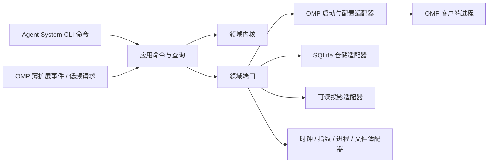
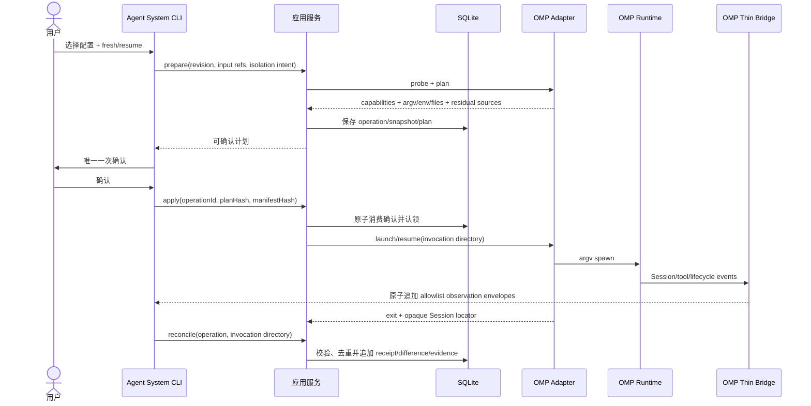
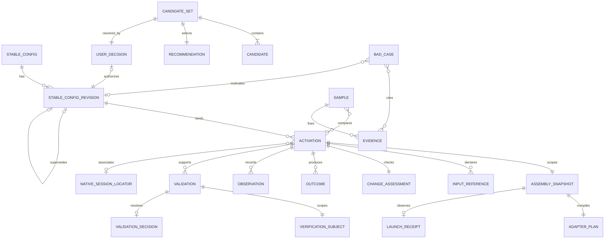

# 架构脊柱 — Agent System MVP

## 设计范式

采用**六边形模块化单体**，以外部 Agent System CLI 为唯一组合根。领域内核定义稳定配置、装配事实、激活、验证与演进规则；应用层拥有全部产品状态变更入口；客户端、SQLite、可读投影、时钟、指纹和进程启动均为适配器。MVP 只实现 OMP adapter；薄 OMP extension 只桥接 PRD 已要求的会话内命令/工具与生命周期观察，不拥有领域状态或配置决定。部署为一个 Bun CLI 加一个同语言薄扩展，不引入 daemon、服务、队列或通用 IPC 总线。



依赖只能指向内层。`domain` 不得导入 OMP、Bun、SQLite、文件系统、进程环境或投影格式；adapter 不得自行做产品决定。OMP、未来 Claude Code/Codex adapter 均实现同一窄端口，但端口只统一装配意图、能力声明和证据，不统一客户端配置文件、Session 或 hook 语义。

## MVP 范围边界（epics.md 为准）

当前锁定的 MVP 范围由 [`epics.md`](../../epics.md) 权威定义：1 个 Epic（查看、选择并使用 OMP 配置）、2 条 Story（1.1 查看与比较配置内容、1.2 选择配置并使用 OMP），覆盖 MVP-FR1～MVP-FR10，OMP-only。本架构脊柱其余正文描述的是完整目标态架构，供未来阶段参考；epics.md AR15 记录了负责人本轮对以下条款的明确裁决，覆盖内容详见对应 AD 内嵌的"MVP 边界"标注与文末 `## Deferred` 小节：

- **AD-16（候选、推荐与用户裁决）：** MVP 不实现，用户直接从已存在的配置修订中选择。
- **AD-7、AD-13、AD-19 对应条款（explicit resume 启动参数、opaque native Session locator 持久化、Session lease/fencing）：** MVP 不实现，resume 完全由 OMP 原生界面负责。
- **AD-11、AD-17（三层验证独立取证、首轮样本与退出门）：** MVP 期间是外部开发验收门，不是 Story 1.1/1.2 交付给终端用户的产品运行时功能。

上述条款保留为已确认的未来架构描述，不因写在本文档中而自动获得当前实施授权；重开需要新证据与负责人明确裁决（epics.md AR13、AR15、AR16）。

## 不变量与规则

### AD-1 — Clean-slate、OMP-first 与未来边界 [ADOPTED]

- **Binds:** 全部能力
- **Prevents:** 从现有 Python CAP 或历史行为恢复需求，以及把未来三端愿景误写成当前支持。
- **Rule:** 只以 PRD、addendum、当前核实的客户端合同和本轮技术研究为设计输入。现有 Python CAP 仅作 Bad Case 证据，不是需求、架构或迁移基线。MVP 只实现并验收 OMP；Claude Code/Codex CLI 不进入 MVP 完成门。允许且必须保留客户端中立的 manifest、receipt、opaque Session locator 与 adapter port；不得预建第二客户端实现、配置等价层或跨客户端 Session 翻译。
- **2026-08-23 追溯澄清（见 PRD §4.4/§7 的 2026-08-23 裁决更新、`sprint-change-proposal-2026-08-23-cap-claude-codex-adapter.md`）：** Claude Code 已由负责人明确裁决激活为第二客户端，纳入 epics.md Epic 4；"Claude Code/Codex CLI 不进入 MVP 完成门"改为——Claude Code adapter 是 Epic 1～3 锁定 MVP 之外新增的独立能力域（见 AD-19、AD-20），不追溯改变 Epic 1～3 已完成/进行中范围本身的完成门槛。**Codex CLI 继续 Deferred**：现有 `.cap/runtime/` 下只有 `claude.toml`，没有 `codex.toml`——即当前没有 Codex 侧真实装配的 Bad Case 证据支持同批激活；Codex 需要独立的新证据与负责人裁决，不因本次 Claude Code 的裁决被顺带打开。"不得预建配置等价层或跨客户端 Session 翻译"这条约束继续原样适用：Claude Code adapter 与 OMP adapter 之间、与未来可能的 Codex adapter 之间都不追求配置或 Session 等价。

### AD-2 — 外部 TypeScript/Bun 控制面 [ADOPTED]

- **Binds:** WF-1、WF-2、WF-3、全部运行能力
- **Prevents:** 把产品状态锁入 OMP 进程、后续逆向抽取隐含合同，以及提前引入多语言、daemon 或服务运维。
- **Rule:** 产品核心实现为外部 TypeScript CLI，由 Bun 编译为目标平台独立可执行文件；领域内核与 adapters 保持 TypeScript。MVP 不增加 Go、Rust、Python sidecar、后台服务、shell 产品脚本或常驻 daemon。OMP 薄扩展同样使用 TypeScript，但只能消费版本化 launch context、转发低频请求并产生事件 envelope，不得连接产品 SQLite 或复制领域规则。若 Bun 分发在连续两个 release 中因企业批准、签名/杀软、native dependency 或发布链形成实证硬门，外部 core 首选迁到 Go，同时保留 schema/JSONL 合同与 TS 薄扩展。

### AD-3 — 控制面、客户端 adapter 与薄桥职责分离 [ADOPTED]

- **Binds:** WF-1、WF-2、FR-1~14
- **Prevents:** CLI、客户端配置和生命周期 hook 形成互不一致的写路径，或 adapter 将某端语义泄漏到领域。
- **Rule:** 外部 CLI 负责配置选择、普通路径唯一一次确认、启动/恢复、状态查询与导出；应用层是唯一产品状态变更入口。客户端 adapter 只能执行 `probe → plan → launch/resume → interpret`，输入输出均为版本化 DTO。OMP 薄扩展的命令/模型工具只把低频配置修订、样本/Bad Case 与证据请求交给外部应用入口；生命周期事件只追加 observation envelope。桥与 adapter 不得直接改 SQLite、派生 `Verified` 或把一个客户端的 precedence、trust、hook、Session 语义提升为公共合同。

### AD-4 — SQLite 是产品持久权威，客户端状态仍归客户端 [ADOPTED]

- **Binds:** FR-3、FR-5~7、FR-12~14
- **Prevents:** 多文件部分提交、索引漂移、跨 Session 丢失，以及复制客户端凭据/transcript 形成第二权威。
- **Rule:** 外部 CLI 进程内的 Bun SQLite 保存稳定配置修订、候选与裁决、激活、装配快照、差异、观察、验证证据、样本、Bad Case、替代链和 opaque native Session locator。JSON/Markdown 仅为 allowlist 投影，可删除重建；invocation-local manifest/plan/event 文件是传输与诊断工件，不是长期权威。凭据、transcript、客户端缓存和原生 Session 内容始终由客户端拥有，禁止导入产品数据库。SQLite 不意味着 daemon；只有多 writer 查询/订阅或恢复压力被实证后才重开服务化。

### AD-5 — 期望状态采用不可变修订

- **Binds:** FR-1~5、FR-10、FR-13、FR-14
- **Prevents:** 装配时静默修改配置、决定被替代后丢失因果、旧 Session 读取漂移目标。
- **Rule:** 每次稳定配置变更创建新的 `StableConfigRevision`，旧修订不可更新。修订显式记录适用工作、必要源资产引用、有限变体、边界和结构化上下文入口；每次 launch assembly 始终绑定一个具体修订。替代通过 `supersedes` 追加，不覆写历史决定。

### AD-6 — 内容所有权与隐私边界

- **Binds:** FR-3、FR-4、FR-9、NFR-4~6
- **Prevents:** 将动态任务、私域原文、凭据或客户端 transcript 复制进稳定配置、数据库、日志或公共投影。
- **Rule:** 稳定配置和持久记录只保存类型化引用、来源标识、允许公开的摘要、内容指纹、新鲜度证据与可观察状态。任务输入由原始载体拥有；私域原文、凭据、动态任务内容与客户端 transcript 只在调用作用域内读取，禁止持久化。数据库、日志、投影、manifest/plan/receipt、bridge envelope 与 invocation 诊断文件均使用显式 allowlist 并拒绝未知字段；bridge envelope 只允许关联 ID、事件枚举、时间、受控状态/原因码、引用和指纹，禁止 prompt、消息、工具参数/结果、原始错误和 transcript。含实际 secret 值的 runtime launch spec 只存在于受限内存或调用期临时文件，不进入 SQLite、投影、receipt 或诊断；终态或恢复归档完成后安全删除。外部来源、MCP 或客户端能力的 `configured`、`installed`、`connectable`、`applied` 不得推导安全性、可信度或任务适用性；分别以证据表达为 Known/Unknown。

### AD-7 — 激活是 launch-scoped 单元

- **Binds:** WF-2、FR-5~10、NFR-7~9
- **Prevents:** 把进程启动授权误当 Session 永久授权、跨 Session 继承动态状态，或部分装配冒充完成。
- **Rule:** 每次激活声明 `ordinary` 或 `controlled-validation`，并绑定 `operationId`、客户端与实际版本、稳定配置修订、声明输入引用/指纹、隔离意图和 `fresh | resume(opaqueLocator)` 选择器。`prepare` 必须持久化 `ChangeAssessment`，逐项比较目标、约束、权限、风险和必需能力；每项为 Known/Unknown，结果只能是”继续原修订”或”进入低频重判”，影响边界与依据必须可回读。比较所需 Unknown 或实质变化未裁决时 fail closed。流程依次为 `prepare → confirm-once → apply/launch → observe/reconcile`；确认只授权本次 `operationId + planHash`。客户端启动后才记录实际 opaque native Session locator。普通复用只接受当前范围内已 `Verified` 且 ChangeAssessment 允许继续的修订；受控验证可使用候选修订但不得标为普通成功。更换配置必须创建新 operation 并重新启动/恢复客户端；旧确认、动态输入和运行期上下文不得继承。
- **MVP 边界（epics.md AR15）：** MVP 不实现 explicit resume 启动参数，不持久化 opaque native Session locator，也不做 ChangeAssessment 式逐项目标/约束/权限/风险重判——该比较隐含任务语义判断，与 epics.md AR7/NFR8 的”不观察任务运行态”裁决不兼容。本条其余部分（launch-scoped operation、单次确认、fail closed）在 MVP 内如实适用；每次配置选择在 MVP 中都作为新的启动计划处理。

### AD-8 — 事实层级、能力与隔离结果不可折叠

- **Binds:** FR-5~7、FR-9~12、NFR-1~3
- **Prevents:** 用计划参数推断客户端实际生效、把未观察解释为 false，或把“参数传入”冒充 Verified。
- **Rule:** 每次激活创建 `AssemblySnapshot`，规范作用域键为 `operationId + stableConfigRevisionId + inputFingerprintSetHash + clientEnvironmentEvidenceId`。期望装配、adapter plan、launch receipt、运行观察、差异与 Unknown 必须引用同一 snapshot。运行装配轴固定为 `observationStage = planned | launched | observed | verified`；`verified` 只能由客户端专项 observation 与验证规则派生。Validation 的方法轴独立固定为 `validationMethod = mechanical | controlled-integration | real-task`，两轴禁止复用字段或互相推导。capability 固定为 `supported | degraded | unsupported | unknown`；隔离回执必须分别列 `excludedSources`、`residualSources`、`unknownSources`。所有不确定值使用 `Known(value, evidenceRef)` 或 `Unknown(reason, observedAt)`；禁止以 `null`、缺行或 `false` 表示未知。

### AD-9 — 客户端副作用不伪装成数据库事务

- **Binds:** FR-6~10、NFR-1、NFR-2
- **Prevents:** SQLite 已提交而客户端未启动/未生效、重试重复启动，以及无法证明的配置恢复成功。
- **Rule:** SQLite 事务与生成文件、进程启动、客户端运行和 extension 事件不声明原子性。`apply` 携带 `operationId + planHash + assemblyManifestHash`；仓储以条件写入从 `awaiting-confirmation` 原子认领为 `applying`，未认领者不得执行副作用。每个 invocation 使用访问权限受限的独立目录；manifest/plan/launch context 通过同目录临时文件原子替换为不可变工件，并携带 operationId、schema version 与持久化 hash，spawn 或 bridge 消费前必须逐项核对，任何缺失/不匹配只记录 incomplete/Unknown。receipt 与 bridge envelope 只是未信任传输输入；应用 command 在 reconcile 时校验 `eventId + operationId + snapshotId + manifestHash + payloadHash`，以条件插入幂等转为 SQLite 中唯一产品事实。文件存在、退出码或解析成功本身不得改变 Outcome。每次启动与 `prepare` 前认领非终态 operation 做 reconcile，并按 `targetResourceKey` 阻止冲突 apply；失败禁止推测回滚、删除客户端数据或把 incomplete/degraded 标成 success。

### AD-10 — 失败关闭与显式降级

- **Binds:** FR-7~10、NFR-2、NFR-5、NFR-6
- **Prevents:** 缺少必要能力、输入、授权或隔离证据时继续运行，以及可选能力缺失被静默忽略。
- **Rule:** 必需能力/输入缺失、实质变化未裁决、权限不足、证据完整性失败、必要配置源无法排除且无显式接受时 fail closed。只有可选项缺失时允许 `degraded`；结果必须列缺失项、受影响能力、残留配置源、差异与 Unknown。状态集合固定为 `prepared | requires-restart | awaiting-confirmation | applying | observing | succeeded | degraded | failed | incomplete | cancelled`，终态不可原位改写。

### AD-11 — 三层验证独立取证

- **Binds:** FR-11、FR-12、NFR-1~3、NFR-7
- **Prevents:** 机械检查通过即声称真实任务有效，或一次表现被外推为稳定能力。
- **Rule:** 证据等级是封闭集合 `mechanical | controlled-integration | real-task`；每条 Validation 绑定 `VerificationSubject = stableConfigRevisionId + capabilitySetHash + taskAcceptanceId + environmentFingerprint`。三层直接证据只有作用域键完全相同时才能汇总。适用性同时满足必要、充分、不过载。`Verified(subject)` 只能在三层均通过且没有阻断性 Unknown 后派生；验证器读取权威查询模型，不从 Markdown、CLI 人类文本或”进程退出码为零”反解析成功。
- **MVP 边界（epics.md AR15）：** 本条在 MVP 期间是外部开发验收门，用于团队判断本轮 MVP 交付是否达标，不是 Story 1.1/1.2 交付给终端用户的产品运行时功能。

### AD-12 — Bad Case 通过追加事实演进

- **Binds:** WF-3、FR-11~14
- **Prevents:** 个案触发客户端特判、样本不可比、旧决定被静默重写。
- **Rule:** `Sample` 固定目标、输入分类、配置修订、客户端/version 与证据口径；`BadCase` 必须引用失败/差异证据、适用边界和拟议变化。只有明确裁决才创建新修订或规则；替代关系保留旧决定及证据。不得在 adapter 或薄扩展中按任务文本增加特判。Profile 语义、Hard Handoff、每任务实时 Skill Discovery、动态子 Agent 装配和第四类核心资产不得作为默认修复，只能由有界证据与明确裁决重开。

### AD-13 — 并发、Session lease 与升级由仓储边界控制

- **Binds:** FR-5~7、FR-12~14、NFR-7
- **Prevents:** 多 CLI 进程写入覆盖、同一 native Session 被并发 resume、半迁移数据库和不可重现升级。
- **Rule:** SQLite 启用 WAL；所有产品表由事务迁移创建为 `STRICT`。可写转换通过条件写入原子认领并携带期望版本；进程内队列不承担跨进程正确性。对已知 `(clientId, nativeSessionLocator)`，launch/resume 前必须在 SQLite 取得唯一持久 lease，记录 `ownerOperationId + 单调 fencingToken`；从认领到 receipt/observation 证明该 writer 的进程树已结束前不得释放。失联 lease 只能由持有匹配 token 的 reconcile 在证明客户端不再写入后回收；不能证明时 locator 保持 blocked，第二 writer 必须 fail closed 或要求 fresh/fork。数据库持久化 reader/writer schema 版本，只允许事务化前向迁移；版本过高时 fail closed，至多开放只读导出。不得使用 ORM 隐藏条件转换、lease、fencing 与迁移语义。
- **MVP 边界（epics.md AR15）：** MVP 不实现。Session lease/fencing 依赖持久 native Session locator，而 MVP 不持久化 locator（AD-7 的 MVP 边界）；本条整体保留为未来能力，重开需要新证据与负责人裁决。

### AD-14 — CLI、桥与客户端按独立故障域设计

- **Binds:** 全部运行能力、NFR-5~9
- **Prevents:** bridge 异常拖垮客户端、wrapper 被 kill 后伪造成功，或客户端退出后继续副作用。
- **Rule:** 外部 CLI 直接 argv spawn，不经 shell；显式管理 cwd/env/stdio/exit/signal，取消向子进程树传播。薄扩展加载阶段不得执行运行动作；事件、命令和工具边界统一捕获并转换类型化失败；不得用 detached promise。launch context、bridge request/response 与 observation envelope 均携带 `operationId + snapshotId + assemblyManifestHash + invocationId`；请求另有 `requestId`，观察另有全局唯一 `eventId` 与单写者序号。桥只按 AD-6 allowlist 原子追加 invocation-local envelope；CLI 在进程退出、显式 reconcile 和下次启动恢复时扫描，经应用 command 验证关联、顺序、hash 与幂等后入库。迟到、重复、冲突或不匹配 envelope 记录为 uncorrelated Unknown，绝不更新 Observation/Validation。桥写失败不得阻止 OMP 原生退出但使对应 observation 为 Unknown。CLI 被 kill 后留下的非终态 operation 只能 reconcile 为可证明结果或 incomplete，不自动重放副作用。

### AD-15 — 控制面发布、客户端升级与高频激活分离

- **Binds:** WF-1、WF-2、NFR-8、NFR-9
- **Prevents:** 每次激活安装/升级依赖或插件、OMP 客户端 contract churn 无门进入，以及外部 CLI 自更新引入未经完整性校验的供应链风险或阻塞正常激活。
- **Rule:** 外部 CLI 以 Bun standalone artifact 分平台发布；OMP 薄扩展通过 Marketplace、Git 或本地 link 分发，但必须与 CLI protocol version 显式兼容。安装/升级默认是低频显式操作，普通激活不得安装依赖、改插件或为 OMP/薄扩展联网更新。**唯一例外：外部 CLI 自身版本可以在进程启动时后台静默检查并原地自更新**——这是本架构唯一允许发生在普通激活路径上的联网行为，且必须同时满足：只读 GET 一个固定、版本化的发布端点（不得从用户可控或运行时派生的 URL 拉取）；下载工件必须先通过完整性校验（签名或已知哈希）才允许替换本地二进制；替换前保留可回滚的旧二进制（如 `.bak`）；检查、下载或校验的任一步骤失败一律静默降级为"本次不更新、继续用当前版本完成本次启动"，不得阻塞或使当前激活失败；更新检查/下载过程不得携带或上报任何遥测、使用数据或产品状态。OMP 自身的版本升级不受本条例外覆盖，继续是低频显式操作：每个支持客户端的实际版本升级先运行 capability probe、adapter fixtures 与 fresh→locator→explicit resume 目标 smoke，再更新兼容 snapshot。文档声称但 release-pinned CLI/help/source 或 smoke 未证实的能力保持 Unknown。"失败静默降级"只约束失败路径；更新成功（二进制已替换）时允许打印一行简洁提示（如版本号），不要求也不因此产生额外确认或阻塞——这一句是 2026-08-23 追溯澄清（见 `sprint-change-proposal-2026-08-23-configs-self-update-visible-success.md`），不改变上述固定端点、完整性校验、`.bak` 回滚、失败静默降级、零遥测等既有约束的实质内容。

### AD-16 — 候选、推荐与用户裁决可追溯 [ADOPTED]

- **Binds:** WF-1、FR-1、FR-2、NFR-6、NFR-9
- **Prevents:** Agent 直接固化首个方案、候选同质化、用户纠偏丢失和低风险决定反复升级。
- **Rule:** 低频配置建立/修订命令必须先持久化触发类别 `new-scenario | known-insufficiency | bad-case` 及对应真实工作引用或证据 ID；缺失时拒绝创建 CandidateSet，单纯发现资产、历史存在或技术可行性不得触发。随后持久化 `CandidateSet`、明确 `Recommendation` 与 `UserDecision`。默认给出 2~3 个、最多 4 个可区分候选；每项记录来源、行为价值、适用工作、边界、关键差异、依据、风险和 Unknown，对具名方法逐项评估。用户可拒绝、补充或纠偏；只有高风险、权限、不可逆或价值取舍才升级。候选空间已覆盖实质差异后停止扩展。
- **MVP 边界（epics.md AR15）：** MVP 不实现。用户直接从已存在的配置修订中选择，没有 Agent 生成的候选或 Recommendation；本条整体保留为未来能力，重开需要新证据与负责人裁决。

### AD-17 — 首轮样本与退出门固定 [ADOPTED]

- **Binds:** FR-11、FR-12、FR-13、NFR-1~3
- **Prevents:** 以单次表现验收、样本口径漂移、同 Session 自证和无限追加采样。
- **Rule:** 首轮任务固定为 T-1、T-2、T-3；无合适 T-3 时以 T-4 替代并记录理由。每项至少记录 1 个当前基线样本和 2 个稳定配置样本，其中至少 1 个来自 fresh 或明确不同的 native Session。Sample 可比性键固定为任务类型、验收口径/结构、输入可比规则、配置无关的客户端/version/环境能力证据，以及已知外部变化：可重复任务要求等价输入；不可重复的一次性任务只要求相同输入分类/结构及到同一验收口径的映射，输入内容/指纹必须记录但不要求相等。任一可比性键不兼容即强制拆组展示并禁止汇总。基线/稳定配置、配置修订/manifest hash、实际声明输入、capability/receipt/隔离结果和 fresh/resume/Session 关系是必须展示的被比较自变量或分层字段，不得误作相等键，也不得隐藏差异。样本另记录任务期干预、无关上下文、失败类型和 Unknown。达到最小样本门时必须原子追加不可变 `ValidationDecision`，绑定配置修订、样本组、证据与负责人裁决；结果只能是接受、调整、停止，或为一个具名 Unknown 追加一次预先说明区分力的采样。
- **MVP 边界（epics.md AR15）：** 与 AD-11 相同处理——本轮是外部开发验收门，不是 MVP 产品运行时功能，不向终端用户暴露样本/ValidationDecision 界面。

### AD-18 — 激活转换表唯一且持久

- **Binds:** FR-5~10、NFR-1、NFR-2、NFR-8
- **Prevents:** 内存确认与持久确认并存、adapter 自选终态，以及取消/恢复后倒退状态。
- **Rule:** 唯一合法转换为 `prepared → requires-restart | awaiting-confirmation | failed | cancelled`；`awaiting-confirmation → applying | failed | cancelled`；`applying → observing | failed | incomplete`；`observing → succeeded | degraded | failed | incomplete`。确认事实持久化 `operationId + planHash + assemblyManifestHash`，只能一次原子消费。in-session 配置切换返回终态 `requires-restart`；新进程/恢复必须创建新 operation。恢复只能沿表前进并追加事实，不能倒退或覆写终态。

### AD-19 — Manifest、capability 与 receipt 是客户端兼容合同 [ADOPTED]

- **Binds:** WF-2、FR-5~12、NFR-1~3、NFR-7~9
- **Prevents:** 两个 adapter 各自“合规”却对支持、隔离、恢复或成功含义不兼容。
- **Rule:** `AssemblyManifest` 只表达 client、project root、configuration revision、instructions/skills/MCP 引用、capability policy、isolation intent 与可选 resume selector；不得包含客户端原生配置结构。每项 capability 以稳定 `capabilityId` 声明 `required | optional` 和目标 observation predicate；plan、receipt 与 Difference 必须沿用相同 ID。事实主体是封闭集合 `configured | installed | discovered | enabled | connectable | connected | approved | applied | used`；plan 返回 `capabilityStatus = supported | degraded | unsupported | unknown`，receipt 返回 `effect = applied | ignored | unknown`，二者均携带 subject 与 evidenceRef，缺项为 Unknown 或按 required fail closed。isolation intent 以版本化 `SourceId` 集合声明每个来源的所需 disposition；plan/receipt 对每个 SourceId 恰好返回 `excluded | residual | unknown`、作用域和 evidenceRef，发现未声明新来源必须追加 unknown。持久 `AdapterPlan` 只保存 argv 结构、环境键、secret/content 引用、不可逆 hash、generated-file metadata 和预期观察；实际环境值/文件内容只进入 AD-6 的非持久 `RuntimeLaunchSpec`。`LaunchReceipt` 返回 effect、`observationStage`、opaque native Session locator、exit 与 allowlist 诊断；Validation 独占 `validationMethod`。全部字段为版本化 tagged union；未知字段、版本或不可观察结果必须 fail closed 或显式 degraded/unknown。
- **MVP 边界（epics.md AR15）：** `resume selector` 与 opaque native Session locator 字段在 MVP 内保持 schema 预留但不产出、不消费实际值——resume 完全由 OMP 原生界面负责。MVP 内 capability 覆盖范围仅服务 MVP-FR6（状态查看）与 MVP-FR9（native-first 辅助面），不含候选/推荐相关 capability。
- **2026-08-23 更新（Epic 4）：** Claude Code adapter 复用同一 `AssemblyManifest`/`AdapterPlan`/`LaunchReceipt` 合同与 `capabilityStatus` 枚举，不新建平行的能力语义。覆盖范围服务 Epic 4 装配 Instructions/Skills/MCP 的硬控制边界——即宿主原生可强制执行的权限/工具/MCP 边界（例如 Claude Code settings.json 权限字段、hook 拒绝返回值），排除任何只靠 prompt 文字承诺、不可被宿主强制执行的"软控制"充当 `supported` 证据。同 MVP-OMP 一样不含候选/推荐类 capability（AD-16 MVP 边界同样适用）。会话生命周期与状态机差异见 AD-20。

### AD-20 — Claude Code adapter 复用同一状态机；已在运行会话的应用只能终止于 requires-restart [ADOPTED]

- **Binds:** AD-7、AD-10、AD-18、AD-19；Epic 4
- **Prevents:** 把"已经在跑的交互式 Claude Code 会话"伪装成可以像 OMP 一样被本产品 fresh spawn 并观察退出码；把无法验证的热更新说成 apply 成功；为 Claude Code 另建一套与 OMP adapter 不兼容的平行状态机。
- **Rule:** Claude Code adapter 不新增状态机；AD-18 的唯一转换表原样适用，按 launch target 分两种：
  1. **fresh** —— 本产品作为新进程 spawn 一个 Claude Code 会话（例如从终端或脚本发起）；完整走 `prepared → awaiting-confirmation → applying → observing → succeeded | degraded | failed | incomplete`，与 OMP adapter 同构，`observationStage` 可以达到 `launched`/`observed`。
  2. **already-running session** —— 目标是当前已经在跑的交互式 Claude Code 会话；本产品不拥有该进程，不能证明、也不得声称能把新的权限/工具/MCP 边界热更新进已加载的会话。这类 plan 的 `apply` 只能解析到既有终态 `requires-restart`（复用 AD-18 已定义的状态，不新增新状态），并入 AD-10 fail-closed：不产生部分应用状态、不冒充成功。`observationStage` 在用户实际重启前保持 `planned`，不得推进到 `launched`/`observed`/`verified`。
  - 两种 target 共享同一份 `AssemblyManifest`/`AdapterPlan`（AD-19）；`plan` 阶段必须显式声明当前 target 属于哪一种，无法判断时按 already-running 更保守的一支处理（fail closed，不擅自假定是 fresh）。
- **Codex 的开放问题：** 本条只覆盖 Claude Code；Codex CLI 的会话模型证据不足（见 AD-1 的 2026-08-23 追溯澄清），留待其自身被激活时重新判断，不预先假设与 Claude Code 相同。
- **2026-08-24 澄清（见 `sprint-change-proposal-2026-08-24-cap-retirement-redesign.md`）：** 本条原文曾以"维护本仓的这个 session 本身"作为 already-running 分支的例子；调查证明本仓自身这个交互式 session 的 skills/CLAUDE.md 由 Claude Code 原生项目目录发现机制读取 git 跟踪文件，与 `.cap` 或本产品的任何渲染/装配管线无关——它不是本产品当前能观察或声明装配来源的对象，因此不适合再作为 already-running 分支的具体例子。规则本身不变：本条仍然覆盖"用户显式请求把某个装配应用到一个已在跑的交互式 Claude Code 会话"这一类未来场景，只是不再把本仓自身维护 session 预设为这类场景的实例。

### AD-21 — Claude adapter 内容物化只存在于调用作用域，从不持久化 [ADOPTED]

- **Binds:** AD-6、AD-9、AD-10、AD-15、AD-19；Epic 4（Story 4.5b）
- **Prevents:** 把"内容引用已声明"误当"内容已交付"；为图省事把真实 Skill/Instruction/MCP 内容写回 SQLite 或投影，破坏 AD-6 的内容所有权边界；对无法解析的引用假装物化成功；把 OMP 的内容装配方式当成跨客户端统一实现；两个独立实现各自发明不兼容的物化目录布局；用文档声称的 flag 行为代替本仓自己的 probe 证据。
- **Rule：** OMP 与 Claude Code 两个 client adapter 在内容装配上存在真实的能力非对称，不追求统一实现——OMP 的 `buildOmpArgv` 只传能力名字（如 `--skills <name1,name2>`），交给 OMP 自身的原生 marketplace/profile 机制解析内容，Agent System 从不物化内容；Claude Code 的 `--plugin-dir` 只接受一个真实文件目录路径，宿主没有"给个名字帮我解析"的原生等价机制。因此 Claude Code adapter 的 launch 阶段必须对装配意图引用的每个 `CapabilityReference`（Instructions/Skills/MCP）把其 `sourceRef` 解析为真实内容（只读操作，内容本身不进入 SQLite/投影/receipt，AD-6 边界不变），写入既有 invocation 隔离目录下一个专用子目录（`<invocation-dir>/materialized/`，复用 Story 4.3 的 `ClaudeInvocationDirPort`，不得写入该目录本身的根——该根同时是 `cwd` 与 `CLAUDE_CONFIG_DIR`，与 Claude 自身内部结构共享命名空间，直接写入会有真实碰撞风险），按类型交付给新 spawn 的 Claude 进程：
  - **Skills** → `materialized/plugin/` 下重建 `.cap` 已实测可被 `--plugin-dir` 正确加载的真实 Claude plugin 包布局（`openspec/changes/archive/2026-08-20-add-claude-cap-adapter/design-spec.md` 的 `native/plugin/` 结构，不是 `.cap` 的私有约定，是 Claude 自己的 plugin 格式）：`.claude-plugin/plugin.json`（name/version/description/`skills: "./skills/"`）+ 每个已解析 Skill 一个 `skills/<name>/` 子目录（`name` 取 `CapabilityReference.name`，按安全路径片段规则清洗），整个包通过一次 `--plugin-dir materialized/plugin` 交付，不为每个 Skill 单独传 `--plugin-dir`。
  - **Instructions** → 解析后的文本直接作为 `--append-system-prompt <text>` 的参数值，不需要落文件。
  - **MCP** → 生成原生 `mcpServers` 格式的 `mcp.json` 到 `materialized/mcp.json`，通过 `--mcp-config materialized/mcp.json` + `--strict-mcp-config` 交付。
  - 物化文件的写入遵守 AD-9 已有的同目录临时文件原子替换纪律，不产生可被读者观察到的半写状态。
  - 调用达到任一终态（`succeeded | degraded | failed | incomplete`）后，`materialized/` 随其余 invocation 目录一并清理；清理时机绑定 invocation 目录整体既有的清理节点（AD-9），不早于——invocation 目录当前对两个 adapter 都还没有真正落地清理代码，这是既有缺口，不是本条新引入的；本条只额外约束：不得在 Claude 进程本身或其显式 spawn 的子进程（MCP server、hooks）已知仍可能读取 `materialized/` 期间执行清理。
  - `sourceRef` 无法解析为真实可读内容时，该 capability 按 AD-10 fail-closed 记为 `unsupported`（必需）或 `degraded`（可选），不得静默跳过或用占位内容伪装已物化。
- **阻塞前提（Story 4.5b 必须先修，不是可选项）：** 今天经 `src/adapters/sources/cap-fs.ts`（`loadCapConfigRevisions`，由 `scripts/seed-from-cap.ts` 调用）从 `.cap/` 灌入的修订，其每个 `CapabilityReference` 的 `sourceRef`/`contentFingerprint` 都被硬编码为 `CAP_FS_FIELD_NOT_CAPTURED`（即 `Unknown`）——本条设想的"当前可靠可解析来源"在实现落地前并不存在，若不修复，AD-10 fail-closed 会让本仓现存的每一条 `.cap`-seeded 修订在 Claude 侧全部降级/不支持，`.cap/` 退役顺序第 2 步的真实烟雾 parity 也无法通过。修复范围有界：`cap-fs.ts` 读取 `.cap/` 时本就知道每个 Skill/Instruction/MCP 条目的真实磁盘路径，只是当前丢弃未记录；Story 4.5b 必须先让它把这个已知路径写入 `sourceRef`，而不是发明新的名字→路径映射规则（`epic-3-context.md` 的"不应在实现层面自行发明映射规则"约束的是尚无协议的真实数据源接入，如 GitHub/本地目录导入，不是修正一个已知但被丢弃的字段）。真实数据源接入协议本身仍是 Epic 3 未拍板的开放问题，不阻塞本条——遇到那类当前无法解析的来源时按上方 fail-closed 规则处理。
- **Probe 前提：** `--plugin-dir`、`--append-system-prompt` 当前只有文档/`.cap` 既有证据核实过，Story 4.1 的 `BunClaudeCapabilityProbe` 尚未把它们纳入探测（与已探测的 `--permission-mode`/`--setting-sources`/`--strict-mcp-config` 不同）；按 AD-15"文档声称但未经 release-pinned probe/smoke 证实的能力保持 Unknown"的既有原则，Story 4.5b 必须先把这两个 flag 纳入 probe 覆盖，不能只凭本轮文档核实就当作 `supported`。同时，Story 4.1/4.5 已记录的版本漂移（`.cap` 核实基线 2.1.236 vs 本机实测 2.1.241，目前只有 `console.warn`、未持久化）在 Story 4.5b 落地前必须重新 probe 一次，不得复用旧快照证据。

### AD-22 — 自我开发装配与产品装配面共用同一条路径；客户端原生发现不是装配面 [ADOPTED]

- **Binds:** AD-1、AD-4、AD-6、AD-8、AD-19、AD-20、AD-21；`entrypoints/agent-system.md`；本仓 Skill 资产面（`plugins/`、`.claude/skills`、`.agents/skills`、`_bmad/`）
- **Prevents:** 把"客户端原生发现 git 跟踪文件"当成一条受认可的装配面，从而让产品为一条无 manifest、无 capability 状态、无 receipt 的路径背书（顶撞 AD-8 的事实层级与 AD-19 的客户端合同）；把上游可复现的第三方 Skill 字节当成仓库源码长期跟踪（形状上等同于同时提交 lockfile 与 `node_modules`）；仓库规则强制加载一批本仓会话结构性不可见的 Skill，使硬门静默降级为空操作；先退役跟踪、后落地替代，重走 `.cap/` 已明确禁止的顺序。
- **Rule：** 产品装配面（消费者是 `configs` 的用户）与本仓自我开发装配面（消费者是在本仓工作的 agent 会话）是两个不同的**消费者**，但共用同一条装配路径与同一套合同——不为后者另立机制。
  - **唯一装配路径。** 本仓 agent 会话获得 Instructions/Skills/MCP 的唯一受认可方式是经 `configs use <revisionId> --client <clientId>` 启动，按 AD-21 在调用作用域内物化交付。客户端原生项目目录发现（Claude Code 读 `.claude/skills/` 已由本仓 session 直接观察证实；`.agents/skills/` 服务 Codex 是**未核实推断**——来源只是 BMad 安装器声明了 `ides: [claude-code, codex, pi]` 三个目标而仓内只有两个目录，按 AD-15 原则在有真实 probe/smoke 证据前保持 Unknown）**不是**装配面：它不产生 `AssemblyManifest`、不绑定 `capabilityStatus`、不产生 receipt，因此在 AD-8 的事实层级里不能为任何能力声称 `observationStage`。未经 `configs` 启动的会话按定义不具备本产品装配的能力——这是本条明确接受的结果，不是待修的缺陷。
  - **Skill 字节的所有权按来源判定，不按存放位置。** 第三方 Skill 组（当前唯一实例 `bmad`，fork 上游 v6.11.0，49 个成员）的字节是**上游可复现产物**，不是本仓源码：仓库跟踪其 **pin**，不跟踪其字节，字节由该 pin 在每台机器上复现。`bmad` 的可复现性已于 2026-08-25 核实，不再是假设——npm 包 `bmad-method` 的当前版本 `6.11.0` 与 `_bmad/_config/manifest.yaml` 的 `installation.version` 一致，两个 module 的 `source` 均为 `built-in` 且 `npmPackage`／`repoUrl` 均为 `null`，据此**推断**其本体随该 npm 包分发、无需另抓（未运行安装器核实，第 (1) 步恢复 canonical 时顺带证实），`_bmad/_config/files-manifest.csv` 记录 263 个文件且每条带 sha256，完整性可校验。一个 pin 只有在同时具备**可取得的来源**与**可校验的完整性**时才算成立；仅记版本号不算。每个 `fork` 组都必须有一个被跟踪的 pin，声明上游 ref 与可复现的取得方式；`bmad` 的 pin 是 `_bmad/_config/manifest.yaml` 的 `installation.version` 加 `_bmad/_config/skill-manifest.csv`，那是 BMad 安装器专有的产物，是当前唯一实例而不是通用格式——再出现来自其他上游的 `fork` 组时，其 pin 落点按本条要求另行确定，不得省略，也不得挪用 BMad 的清单。本仓自研 Skill 组（`plugins/` 下 `own`／`vendor` 各组）的字节是本仓源码，继续跟踪。
  - **第三方组按 vendor 内容跟踪一份（2026-08-25 裁决，取代本条原有的落点规则）。** 本条原写「字节的落点不得是原生发现路径」，并据此推导出「跟踪 pin 不跟踪字节、canonical 落 `_bmad/`、安装器配置为不产生 IDE 投影」一整套。**该推导有两处错，均已实证：** 其一，负责人的原话是「原生启动的会话不再受支持」，是一句**承诺范围**的声明，被错误地推成了「机制上不可能」这条**强制要求**——而 AD-22 自己那条「用户级安装本仓管不到」的已知限制早已说明强制无法完整，这个矛盾当时没被发现；其二，实跑安装器证明「配置为不产生 IDE 投影」做不到，投影是它唯一的产出形式。**更根本的是目标被搞错了：** 负责人 2026-08-25 澄清，要停掉的是「必须靠一个安装步骤才能装上」，不是「在 git 里存第三方字节」——价值排序是「clone 即可用」高于「不提交第三方内容」。**现行规则：** 第三方 Skill 组作为 vendor 内容跟踪**一份**于 `vendor/<组>/skills/<skill>/`（当前唯一实例 `vendor/bmad/`，49 个 Skill）。不按客户端投影成多份，不引入包管理器，不跑安装器。零安装步骤、无重复、无第二处可分叉，原「两份逐字节相同」的一致性门因此失去对象并已退役。客户端原生发现目录不再承载字节，`configs` 是唯一装配路径——这一条现在是**目录布局的自然结果**，不再是一条需要靠机制强制的规则。
  - **组是第一结构。** 装卸、版本、发现、判定与复核都以**组**为单位，不以单个 Skill 为单位（当前 12 个组 / 82 个 Skill：判定 12 次，不是 82 次）。一个组可以服务多个事项，组内成员互相调用（路由、deprecated 转发），拆组会拆断这些调用，因此组是不可再分的装配与判定单元；`configs` 的装配意图、上面的字节所有权判据与下面的退役顺序全部按组表达。组的来源三分——`own`（自研，无上游）、`fork`（取自上游、承诺零本地改动、更新即拉上游新版）、`vendor`（取自上游但已打补丁，必须逐处登记）——是上面"按来源判归属"的判据本身，不是描述性标签；`fork` 的零改动必须可机械验证（内容指纹与上游 ref 不符即承诺已破，须转 `vendor` 或把改动推回上游），不接受仅凭声明。该模型此前只存在于 `tools/skill_registry/README.md`（一个工具的 README，不在权威面上），本条将其固定。
  - **退役顺序（严格按序，不得先退役后落地）。** 复用 `.cap/` 退役已确立的三步形状：**(1) 落地替代**——`configs` 具备把一批磁盘上的 Skill 目录变成 `sourceRef` 可解析之修订的供给能力（缺口记于 `#1`（原 `Eridanus117/agent-system#173`，随仓重建后编号变更），且本仓自身的装配意图能被表达为一条真实修订。本步的两项前提已由负责人于 2026-08-25 裁定（见 `#1`）：字节来源为按 pin 运行 BMad 安装器写出 canonical 到 `_bmad/`；原生启动的会话不再受支持。**2026-08-25 更正：** 本步原写「必须先修一处现状：本仓当前的 BMad 安装是残缺的、254 个 canonical 本体已被删除」——**该判断错误，已实跑安装器推翻：没有任何东西被删，skill 本体从来就不落在 `_bmad/` 下**（详见上一条 Rule 的同日更正）。本步因此**不存在「恢复 canonical」这项前置**。`configs` 物化的来源就是 IDE 投影目录本身——实测 `--group .agents` 可扫到全部 49 个 bmad Skill，Story 3.5／3.6 已在此基础上跑通全链路（3 个组 / 51 个 Skill，零失败）。真正待解决的是**第 (3) 步**：既然投影目录同时是字节的唯一落点与客户端的发现路径，「退役跟踪」与「不得落在发现路径上」两条如何同时满足，需在第 (3) 步动工前另行裁定。**并且必须在这一步一并裁定 `sourceRef` 的跨机器可移植性语义**——本条规定第三方组字节由每台机器各自复现，同一条修订在两台机器上对应的绝对路径必然不同，而 AD-21 只说"把 `sourceRef` 解析为真实内容"、既有 `content-materializer.ts` 的实现把它当作可直接使用的路径、AD-21 的阻塞前提段又要求 `cap-fs.ts` 写入"已知的真实磁盘路径"，三处合起来事实上假定了绝对路径，与每机复现直接冲突。**该裁定已于 2026-08-25 作出并落地，本开放项至此关闭**（Story 3.4，见 `_bmad-output/implementation-artifacts/spec-3-4-sourceref-跨机器可移植性语义.md`，合并于 `8d56565`）：`sourceRef` **只有一种合法形态——库内相对 POSIX 路径**；绝对路径一律拒绝；根由单一共用的 `defaultSupplyRoot()` 提供，是本机配置、不进修订，机器差异只由根承担。五条判定规则——非空 → 不含反斜杠 → 不带盘符前缀 → 非绝对 → 解析后严格落在根内——集中在唯一实现 `validateSupplyRelativeRef`（`packages/control-plane/src/cli/supply-root.ts`），供给侧与解析侧共用，**不存在任一侧的单独覆盖入口**，因此「禁止两个实现者各自发明」这条约束从此由机制保证而非靠自觉。其中第③④两条不是防御性编程，是实测逼出来的：`known('')` 与 `known('.')` 会让 `path.resolve` 返回根本身，`cp --recursive` 随后把整个供给库当作一个 Skill 拷入**并报告启动成功**，把 AD-10 的 fail-closed 翻成 fail-open；与根同盘的 `C:x/y` 在 win32 被折进根内而接受（且收敛判定转为依赖 `process.cwd()`），`C:/x/y` 在 POSIX 上 `isAbsolute` 为假而被当普通相对名接受——同一条修订两个平台含义不同。兼容性依据：实测真实库中 20 个 skill 条目的 `sourceRef` 全为 `Unknown`、Known 零条，拒绝绝对路径不作废任何真实数据；**(2) parity 验证**——经 `configs use` 启动的本仓会话，其实际可用 Skill 集合与今天由原生发现得到的集合做真实烟雾对照，不是清单比对；**(3) 退役**——`.claude/skills/`、`.agents/skills/` 改为非跟踪并进入 `.gitignore`，`skill-asset-checks.yml` 的双份字节一致门随之退役。第 (2) 步稳定之前，两份保持 git 跟踪、一致门继续生效。
  - **装配权威唯一。** `plugins/skill-imports.toml` 当前自称"当前默认装配声明"，实际只列 1 条且无任何产品代码读取（全仓唯一引用者是一致性测试 `plugins/tests/workflow-routing.test.ts`）——它不是装配权威。装配权威只有 `configs` 的修订（AD-4）。该文件与 `plugins/README.md` 的对应措辞在退役第 (3) 步一并收敛，不在此之前单独改动。
  - **规则与能力必须同真。** 仓库规则（`entrypoints/agent-system.md` 及其投影）不得强制加载一个本仓当前装配下不可获得的 Skill。任一时点二者必须一致：要么该 Skill 进入本仓装配意图，要么该规则改写或删除。"加载可用的 X"这类措辞**不构成豁免**——它把硬门静默降级为空操作，正是本条要防的失败模式。此前已知的不一致——`entrypoints/agent-system.md` 第 62 行要求的 `orchestrated-collaboration`、第 78／84 行要求的 `adaptive-problem-solving`（后者含"父目标验收"硬门）都只存在于 `plugins/`、不在任何客户端的原生发现路径上，因而对本仓会话结构性不可见——**已于 2026-08-25 消除**（Story 3.6）：两者现已在本仓装配意图内，实测经 `configs supply` 与真实物化器可交付（51 个 Skill 零失败）。**本条从此由机制维持而非靠人记得**：意图不由任何声明文件表达，而是从本条点名的入口规则与 `_bmad/_config/` 的安装器清单**推导**得出，因此「改规则」与「改意图」是同一个动作，二者在构造上无法漂移；一致性由验证边界的现行门（`tools/assembly_intent/`）在本机与 CI 两处强制。
  - **供给库根在本仓自我开发场景下应可自动识别（2026-08-25 追加，见 Issue #8、Epic 5 Story 5.2）。** 当前 `defaultSupplyRoot()` 要求调用方每次手动设置 `CONTROL_PLANE_SUPPLY_ROOT` 指向仓库根，否则静默回退到发行版默认根、导致 `sourceRef` 解析到错误位置——这是本条"共用同一条装配路径"原则下的一个已知但未落地的缺口，不是新增例外：自动识别机制本身仍必须遵守"根不进修订、只在本机生效"的既有约束（本条 Rule 第 (1) 步已裁定的可移植性语义），只是把"人工设置"这一步改为"检测到位于 agent-system 仓内时自动推导"，且仅在环境变量未显式设置时生效，不改变发行版用户场景的既有默认值逻辑。具体检测方式留给 Story 5.2 实现时判断（例如向上查找带 `vendor/bmad` 与 `plugins/` 的仓库根标记）。
- **开放问题（不阻塞本条，落地第 (1) 步时判断）：** Codex CLI 侧尚无等价的 `configs` 启动入口（Codex 仍按 AD-1 Deferred），因此第 (2) 步的 parity 验证在 Codex 侧暂时无法执行。是否允许两个客户端按各自节奏分别退役各自的投影目录（先退 `.claude/skills/`、`.agents/skills/` 等 Codex 激活后再退），留待第 (1) 步落地时依据当时的真实能力判断，不在本条预先裁定。

### AD-23 — Claude adapter fresh 启动延续登录凭据，且不持久化 [PROPOSED]

- **Binds:** AD-6（secret 只存在于调用作用域）、AD-9（invocation 目录清理）、AD-21（内容物化模式）；Epic 5（Story 5.1）
- **Prevents:** fresh 启动的新 Claude Code 进程因 CLAUDE_CONFIG_DIR 隔离丢失登录态；为图省事把凭据复制进任何持久化产物（SQLite/投影/receipt）；清理时机早于进程仍可能读取凭据的窗口。
- **Rule:** launch 阶段在把 CLAUDE_CONFIG_DIR 指向隔离 invocation 目录之前或同时，把当前真实登录凭据（真实存储位置与格式需先经 probe 核实，不同平台可能不同）只读复制一份到该隔离目录内；复制操作与 AD-21 的物化内容一样，只存在于调用作用域，不写入 SQLite/投影/receipt。清理时机复用 AD-9/AD-21 已有的 invocation 目录清理节点，不早于进程及其显式 spawn 的子进程已知不再读取该目录期间。若凭据文件不可读或格式无法识别，按 AD-10 fail-closed：整个 fresh 启动记为 unsupported/degraded 并说明原因，不产生"看起来成功、实际未登录"的部分状态。
- **状态说明：** 标 `[PROPOSED]` 而非 `[ADOPTED]`——需要 Story 5.1 落地时先核实 Windows 上 Claude Code 凭据的真实存储位置和格式，再转正。2026-08-25 新增，见 `sprint-change-proposal-2026-08-25-epic-4-post-delivery-fixes.md`、Issue #9。

## 一致性约定

| Concern | Convention |
| --- | --- |
| 标识符 | 产品实体使用不透明 UUID；`operationId` 贯穿命令、invocation 目录、日志、证据和投影；native Session locator 是按客户端 namespaced 的不透明值。 |
| 时间 | UTC RFC 3339；同时记录采集时间与来源声明时间，不用文件 mtime 推断业务新鲜度。 |
| 事实值 | `Known<T>` / `Unknown` tagged union；Unknown 含原因码与观察时间。 |
| 能力 | `supported | degraded | unsupported | unknown`；不得用布尔值压平。 |
| 运行装配证据 | `observationStage = planned | launched | observed | verified`；退出码零至多证明 launched/exit，不证明配置 verified。 |
| 验证方法 | `validationMethod = mechanical | controlled-integration | real-task`；与 observationStage 是独立轴。 |
| 错误 | 应用层返回封闭类型化错误联合；adapter 保留 cause，用户输出与投影只暴露 allowlist。 |
| 状态变更 | 仅应用 command 可写；query、projection、adapter probe 与 lifecycle observation 不改期望状态。 |
| 事件命名 | 领域事实用过去式；OMP/Claude/Codex 原生事件名只存在于各自 adapter/bridge。 |
| 日志 | 至少含 `operationId`、client/version、阶段和结果码；默认拒绝 prompt、凭据、私域原文、transcript 与工具参数。 |
| 配置 | 稳定配置引用 Instructions、Skills、MCP 与结构化输入入口；动态任务内容不进入修订。 |
| 数据库 | 参数化 SQL、显式列、`STRICT`、事务迁移；禁止 `SELECT *` 进入投影。 |

## 语言与技术栈选择

| 候选 | 运行与客户端集成 | 类型与测试 | 分发 | 长期维护成本 | 结论 |
| --- | --- | --- | --- | --- | --- |
| TypeScript + Bun | 外部 CLI 与 OMP 薄扩展同语言；adapter 直接生成 argv/env/files，扩展使用 OMP TS API | schema/types/fixtures 单栈；`bun:test` 覆盖 core、repository 与 adapters | Bun standalone executable；扩展经 Marketplace/Git/local | 少一个跨语言 schema 边界；风险是 Bun 企业批准与 OMP API churn | **采用** |
| Go + TS bridge | Go core 外部进程，OMP 仍需 TS bridge | 静态类型与测试强，但需生成类型和跨语言 golden fixtures | 原生二进制发布成熟 | 两语言；若 Bun 发布链实证失败则是最小反转 | **条件性第一反转** |
| Rust + TS bridge | 与 Go 相同，交叉目标常需 linker/toolchain | 类型与内存安全强 | 独立二进制强 | 构建与认知成本最高；当前控制面无对应资源/安全硬门 | 不采用 |
| Python/纯脚本 + TS bridge | 依赖解释器/venv 或额外打包；仍需 TS bridge | 运行时类型与环境一致性额外维护 | zipapp 仍需解释器，venv 不可搬迁 | 双栈、环境漂移、并发恢复与五年 churn 成本最高 | 不采用 |

### 冷启动版本种子

| Name | Version policy |
| --- | --- |
| Bun | 实现时在 lock/toolchain 中精确钉住；OMP `main` 的移动值不得作为产品 toolchain 决定 |
| TypeScript | 产品 lockfile 精确钉住；不得把文档中的 semver range 当兼容证明 |
| OMP | 首个支持版本只由 release-pinned probe 与真实 smoke 生成 capability snapshot；不从 `main` 推导 |
| SQLite | 与钉住的 Bun runtime 同版本发布，仓储合同验证 `STRICT`、WAL 与迁移 |
| 测试运行器 | 使用同一钉住 Bun 的 `bun:test` |

这些只是冷启动种子。代码落地后，包清单、lockfile、capability snapshots、adapter fixtures 和目标 smoke 共同拥有兼容事实；官方 `main` 或训练数据不得替代发布证据。

## 结构种子

以下结构只固定边界和所有权；完整字段与表布局由合规代码拥有。

```text
packages/
  control-plane/
    src/
      cli/                     # 唯一外部用户入口与组合根
      domain/                  # 纯领域实体、不变量、状态机、事实层级
      application/             # commands、queries、ports、DTO
      adapters/clients/omp/    # probe、plan、launch/resume、interpret
      adapters/clients/claude/ # probe、plan、launch/resume、interpret（Epic 4；硬控制边界，复用 AD-19 窄端口，会话模型见 AD-20）
      adapters/sqlite/         # repository、transaction、migration
      adapters/projection/     # allowlist JSON/Markdown
      adapters/system/         # process、clock、fingerprint、invocation files
    migrations/
    schemas/                   # manifest、plan、receipt、bridge event
    tests/
      domain/
      contracts/
      integration/
      smoke/
  omp-bridge/
    src/index.ts               # 低频 request 与 lifecycle event；无领域状态/DB
```

不新增 `adapters/clients/codex/`：现有 `.cap/runtime/` 只有 `claude.toml`，没有 `codex.toml`，当前没有 Codex 侧真实装配的 Bad Case 证据支持同批建目录；Codex 需要独立证据与负责人裁决后再补（AD-1、Deferred）。下方时序图描述的是 OMP adapter 的 fresh/resume 流程；Claude Code adapter 的 `already-running session` 分支不经过这条 spawn→退出码路径，按 AD-20 在 `apply` 即解析为 `requires-restart`，不产出独立时序图（未构成与 OMP 不兼容的新协议，只是同一状态机下的另一条终态路径）。





不部署远程服务、队列、共享数据库或产品遥测。真实客户端配置只生成在 invocation/profile 隔离边界内；不清空、改写或恢复真实用户全局配置。OMP bridge 不假设完全隔离；它只报告实际观察。in-session 配置切换返回 `requires-restart`，由外部 CLI 创建新 operation 并以新 manifest 启动/恢复。

## 能力 → 架构映射

| Capability / Area | Lives in | Governed by |
| --- | --- | --- |
| WF-1 配置建立与修订；FR-1~4 | domain/config、application commands、CLI、OMP bridge request | AD-3、AD-5、AD-6、AD-16 |
| WF-2 高频激活；FR-5~10 | domain/activation、application、OMP client adapter、process runner | AD-7~10、AD-18、AD-19 |
| 三层验证与首轮样本；FR-11~12 | domain/validation、application queries、integration/smoke | AD-8、AD-11、AD-17 |
| WF-3 样本与 Bad Case；FR-13~14 | domain/evolution、application commands、CLI/bridge request | AD-5、AD-12、AD-17 |
| 跨 Session 追溯 | SQLite adapter、queries、projection、opaque locator | AD-4、AD-7、AD-13 |
| 隐私与授权；NFR-4~6 | reference policy、projection、client adapter/bridge | AD-6、AD-10、AD-14 |
| 机械检查与低激活负担；NFR-7~9 | application、CLI、capability probe、测试门 | AD-11、AD-15、AD-19 |
| 后续客户端接入边界 | client adapter port、manifest/plan/receipt schemas | AD-1、AD-3、AD-19 |
| Epic 4：Claude Code 装配（Instructions/Skills/MCP 硬控制、内容物化、CLI 入口）| domain/activation（复用）、application、Claude client adapter | AD-1、AD-19、AD-20、AD-21 |
| 本仓自我开发装配（Skill 资产存放、组织与进入会话的路径） | `plugins/`、`_bmad/` pin、`configs` 修订与 Claude/OMP client adapter | AD-4、AD-8、AD-19、AD-21、AD-22 |

> **MVP 范围提示：** 当前锁定 MVP（epics.md）只落地与 MVP-FR1～MVP-FR10 对应的部分。"WF-1 配置建立与修订"行中的候选/推荐（AD-16）与"跨 Session 追溯"行中的 opaque locator 持久化（AD-7/AD-13/AD-19 对应条款）延后；"三层验证与首轮样本"行（AD-8、AD-11、AD-17）在 MVP 期间是外部开发验收门，AD-8 的事实层级/Known-Unknown 表达本身仍在 MVP 内用于状态视图。

## 验证边界

- **Schema/类型合同：**独立 TypeScript 检查锁定领域 union、应用端口、manifest/plan/receipt/bridge schemas；未知字段或版本不得被宽松吞掉。
- **领域层：**`bun:test` 覆盖唯一转换表、确认消费、Known/Unknown、capability/evidence levels、AssemblySnapshot/VerificationSubject、修订替代、fail-closed、degraded 与 Verified 派生；不加载 OMP 或真实 SQLite。
- **仓储合同：**对 `:memory:` 与文件 SQLite 运行相同 contract；覆盖 `STRICT`、跨连接认领、native Session lease、唯一键、乐观冲突、非终态恢复、schema 版本过新只读降级、迁移失败、幂等与 WAL 重开。
- **隐私合同：**以含 prompt、凭据、私域原文、transcript、工具 payload 和未知新增字段的夹具验证数据库、日志、投影、manifest/plan/receipt、bridge envelope 与 invocation 诊断不泄露；runtime secret 只存在于调用作用域，任一受限字段落盘时测试失败。
- **Adapter contract：**同一 manifest 生成确定的持久 plan 与非持久 RuntimeLaunchSpec；持久 plan 只含环境键/引用/hash，不含 secret/content；覆盖 capabilityId/subject、required/optional、SourceId 完备 disposition、supported/degraded/unsupported/unknown、resume selector、cwd/env、退出码与 receipt 解释。
- **故障实验：**实际杀死 wrapper 或 OMP，验证工件 hash/权限/关联不匹配只产生 incomplete/Unknown、envelope 可幂等导入、runtime secret 与终态工件按合同清理；覆盖同一 native Session 两个 writer 只有一个 fencing lease，不能证明遗留进程停止时 locator 保持 blocked。
- **目标 OMP smoke：**在钉住 OMP/Bun artifact 上执行 fresh→取得 opaque locator→explicit resume；完成配置修订、Skills/MCP 启动装配、extension observation、失败重试与导出；覆盖非 ASCII/空格路径、既有全局配置、未知 capability 与 bridge 不可用。
- **Claude Code adapter contract（Epic 4）：**fresh target 覆盖同一 Adapter contract 门（capabilityId/subject、required/optional、supported/degraded/unsupported/unknown、退出码与 receipt 解释）；already-running session target 专项覆盖 AD-20——验证 `apply` 在该 target 下必然解析为 `requires-restart`、`observationStage` 在重启前不越过 `planned`，且对同一 plan 无论 target 判断结果如何都不产生部分应用的 SQLite 事实；与 `.cap/` 现有 lock/render 产物的 parity 验证按"`.cap/` 退役顺序"第 2 步执行，覆盖 AD-21 物化后的真实交付内容，不止是 manifest 结构比对。
- **Claude adapter 内容物化合同（AD-21，Story 4.5b）：**验证每个 `CapabilityReference` 的 `sourceRef` 解析结果只进入调用作用域内的 invocation 目录，从不写入 SQLite/投影/receipt；调用终态后物化产物被清理，不留存；`sourceRef` 不可解析时对应 capability 正确记为 `unsupported`/`degraded`，不产生占位内容或静默跳过。
- **自我开发装配一致性（AD-22，**现行门**，实现见 `tools/assembly_intent/`，在本机与 CI（`.github/workflows/repository-checks.yml`）两处真实执行）：**该门机械校验「仓库规则强制加载的每个 Skill 都在本仓当前装配意图内」——解析不到即失败，不接受「加载可用的 X」措辞作为豁免。**它由推导驱动，不由声明驱动：**本仓不新增、也不存在装配声明文件；装配意图从两处已有且各因别的理由存在的权威推导——`entrypoints/agent-system.md` 里「加载可用的 `<名>` Skill」点名的每个 Skill（推出组 `plugins/<名>`），与 `_bmad/_config/skill-manifest.csv` 加 `manifest.yaml` 的 `installation.version` pin（推出组 `.agents`）。多一份清单就会与入口规则漂移，而漂移正是 `plugins/skill-imports.toml` 失效的死因；推导让「改规则」与「改意图」成为同一个动作，漂移在构造上不可能。推导出的组集合喂给**真实的 `configs supply` 子进程**解析（检查侧不重写 `<根>/<组>/skills/<skill>/` 这条目录约定，「组是什么」只有一个实现），再断言每个被点名／被清单声明的 Skill 确实出现在 `supply` 的真实产出里；`supply` 非零退出时透传其类型化原因，不伪装成「一致」。代价如实记：从散文里正则提取是脆的，缓解是一条反向断言——提取数为 0 时该门**必须**红，而不是静默报出「没发现不一致」。当前实测：推导出 3 个组、51 个 skill，退出 0。退役第 (2) 步的 parity 验证是一次性真实烟雾对照（经 `configs use` 启动的会话实际可用 Skill 集合 vs 原生发现集合），不是清单比对，也不是长期双运行。
- **产品验收：**按 AD-17 执行 T-1/T-2/T-3（或记录理由的 T-4），每任务 1 个基线加 2 个稳定配置样本且至少 1 个不同 native Session；自动化不能替代真实任务观察。

## `.cap/` 退役顺序（Epic 4）

`.cap/`（`manifest.toml`、`profiles/*.toml`、`runtime/claude.toml`、`skill-imports.toml`）是本轮问题的证据来源与迁移前身，不是需求或架构基线（AD-1）。

**2026-08-24 重写（见 `sprint-change-proposal-2026-08-24-cap-retirement-redesign.md`）：** 原四步顺序的第 3 步"本仓自身切换"已证明其对象不存在——本仓自己这个正在运行的交互式 Claude Code session，其 skills/CLAUDE.md 由 Claude Code 原生项目目录发现机制读取 git 跟踪文件，与 `.cap` 的渲染管线无关，不存在"从 `.cap` 切换过去"这个动作的对象（见 AD-20 的 2026-08-24 澄清）。退役顺序收窄为以下**三步**，且**严格按序**——不得先退役 `.cap/` 再设计替代：

1. **落地新 adapter：** `adapters/clients/claude/` 实现 probe/plan/launch/interpret，产出的 `AssemblyManifest` 必须覆盖 `.cap/manifest.toml` + `profiles/*.toml` + `runtime/claude.toml` + `skill-imports.toml` 当前表达的全部装配意图（本仓现存的 `general`、`agent-assembler` 两个 profile 是最小覆盖集）；**并且**具备 AD-21 的内容物化能力（不只是硬控制 flag，真正把 Instructions/Skills/MCP 内容交付给新 spawn 的进程），**并且**在 `configs` CLI 有真实可调用入口（`domain/client.ts` 的 `resolveClientSupport('claude-code')` 基于真实探测而非硬编码 unsupported）。
2. **一次性 parity 验证：** 新 adapter fresh 启动的真实产出——经 AD-21 物化后实际交付的 `--plugin-dir`/`--append-system-prompt`/`--mcp-config` 内容——与 `cap use <role> --cli claude` 的真实产出做真实烟雾对照，不是静态 manifest 结构比对；证明覆盖本仓现有场景后才能继续，这是一次性证据收集，不是长期双运行。
3. **退役 `.cap/` 本体：** 仅在第 2 步验证稳定后，移除 `.cap/` 目录，并把 `openspec/specs/` 下与 `.cap/` 直接相关的现存 spec（`v3-assembly-executor` 已确认相关，其余条目由实现时逐一核实，注意这些是 `openspec/specs/` 下的 spec，不是 `openspec/changes/` 下待处理的 change）收敛为归档状态；`.cap/` 历史内容降级为证据参考，不再作为任何当前需求或架构的权威来源。

## Deferred

- 稳定配置、证据与 Bad Case 的完整字段 schema：实现故事在不违反 AD-5、AD-6、AD-8、AD-11 下确定。
- CLI 命令名、OMP bridge 工具名、TUI 文案与投影视图：UX/实现层决定，不得改变职责、状态所有权或一次确认上限。
- Claude Code/Codex adapter 实现与产品承诺：MVP 不实现；只有产品合同明确激活第二客户端后，按 AD-19 增量资格，不追求配置或 Session 等价。**（2026-08-23 更新：Claude Code 已激活，见 AD-1、AD-19、AD-20 与结构种子、epics.md Epic 4；Codex 仍按本条原样 Deferred，等待独立的 Bad Case 证据与负责人裁决。）**
- OMP bridge 是否需要同步 tool interception、provider/context mutation 或原生 UI：只有具名用户结果和真实证据出现后扩展；默认只做 PRD 所需低频请求与 observation。
- daemon、远程同步、团队共享状态、服务化、遥测：不在 MVP；只有多 writer/订阅/共享合同明确出现后重开。
- 记录保留、压缩、备份与用户删除 UX：数据量、法规或恢复目标出现后决定；删除不得伪造替代链。
- 本地数据库加密与系统密钥库：当前禁止持久化秘密；若未来必须保存，先建立独立威胁模型与授权合同。
- Profile 产品语义、Hard Handoff、每任务实时 Skill Discovery、动态子 Agent 装配和第四类核心资产：不作默认修复；只有 PRD 新增用户结果/FR、真实任务证据和明确裁决时重开。
- Rust core：仅在出现可测的严格资源/安全边界或关键 Rust-native 组件后重开；“单文件更原生”不足以承担双栈。
- 性能 SLO 与数据库归档阈值：PRD 未给量级；以真实激活测量，出现瓶颈后再定。
- 候选、推荐与用户裁决（AD-16）：MVP 不实现，用户直接选择已存在配置；只有新证据与负责人明确裁决才重开（epics.md AR15）。
- Explicit resume 启动参数、opaque native Session locator 持久化与 Session lease/fencing（AD-7、AD-13、AD-19 对应条款）：MVP 不实现，resume 完全由 OMP 原生界面负责；只有新证据与负责人明确裁决才重开（epics.md AR15）。
- Codex CLI 侧的 `configs` 启动入口与 `.agents/skills/` 投影退役（AD-22 第 (3) 步的 Codex 半边）：Codex 本身仍 Deferred，无入口即无法做 parity 验证；只有 Codex 按 AD-1 被独立证据激活后重开。
- 三层验证与首轮样本退出门作为产品运行时功能（AD-11、AD-17）：MVP 期间保留为外部开发验收门，不向终端用户暴露；只有新证据与负责人明确裁决才重开（epics.md AR15）。
