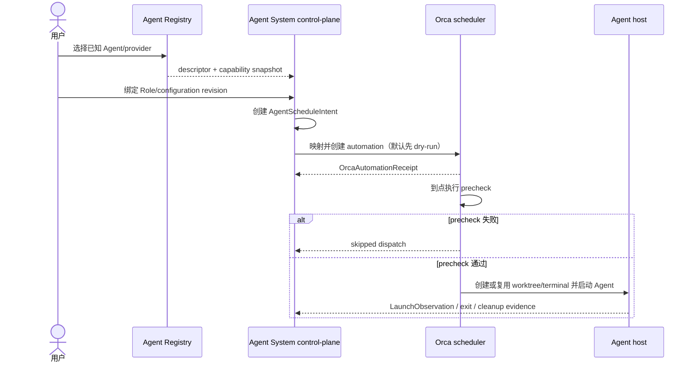

# 业务现状

## 调查口径

- 调查时间：2026-08-31。
- 业务范围：在不复制客户端原生语义的前提下，让一个稳定 Agent/Role revision 进入 Orca 调度，并分别获得计划、派发和实际观察证据。
- 证据来源：负责人审阅设计、`openspec/config.yaml`、当前架构脊柱，以及当前 `packages/control-plane` TypeScript/Bun 源码。
- 现状判断只区分已实现源码、已核实外部合同和待实现设计；文件存在不等同于运行能力已验收。

## 外部合同与业务角色

| 角色/边界 | 当前可确认事实 | 本 change 的边界 |
|---|---|---|
| 负责人/用户 | 可选择稳定配置修订并授权一次启动；调度输入还需要 Agent、trigger、target 和 Session policy | 不替用户推断 provider 支持，不把 automation 创建当作 Session 成功 |
| Orca runtime | 版本匹配证据为 ready、`1.4.192`；调度入口为 `orca automations create --provider <agent>` | Orca 负责计时器、RRULE、worktree、terminal、host 和 Agent 进程生命周期；Agent System 不重实现 |
| Orca provider | CLI 指南已知 ID 为 `claude`、`codex`、`omp`、`pi`、`grok`，并允许 generic installed TUI providers | 已知 ID 仍需各自 discovery/probe/assembly/dispatch/observation/recovery 证据；Hermes 保持 `unknown` |
| Agent System control-plane | 当前激活与观察以 `ClientAdapter` 和 OMP/Claude 为中心 | 增加 Agent Registry、调度意图、派发事实和证据关联；不改变既有 OMP/Claude native 行为 |
| Agent adapter | OMP/Claude 当前有独立 adapter；不同客户端不共享配置文件、权限、Skill/MCP 加载或 Session 语义 | 只共享窄的 AgentAdapter 和统一证据合同 |
| SQLite/证据 | 当前激活操作和 launch observation 有 SQLite repository 路径 | SQLite 保持产品事实权威；manifest、receipt、launch context 仅按 allowlist 保存 |

## 当前业务对象与缺口

| 对象 | 当前事实 | 缺口/待实现 |
|---|---|---|
| `ConfigurationRevision` | 现有控制面向配置修订装配能力引用 | 尚未绑定为一个 Agent schedule 的稳定输入 |
| `ClientAdapter` | `client-adapter.ts` 定义 `probe`、`prepare`、`start`、`observe`、可选 `abort` | 术语尚未收敛为 `AgentAdapter`，没有统一 Orca provider registry |
| OMP adapter | 当前构造 OMP argv，按能力是否含 Skill 使用 `--skills` 或 `--no-skills`，并传递受控 launch context | 没有 Agent 调度意图到 Orca automation 的应用用例 |
| Claude adapter | 当前将 instructions、skills、MCP 在 invocation 目录中物化，分别使用 `--append-system-prompt`、`--plugin-dir`、`--mcp-config`/`--strict-mcp-config` | 没有与 schedule/dispatch 事实关联的 Orca 运行闭环 |
| Activation operation | 当前应用层用 `clientId` 查 adapter、持久化阶段并追加 `LaunchObservation` | 需要增加 `agentId`、scheduleId、operationId、revisionId、target 和 manifest hash 的派发关联 |
| Orca automation | 设计和 CLI 合同已确认调度入口；当前 control-plane 源码中未见 Orca scheduler/dispatch adapter | 需要 dry-run 映射、receipt、取消和 reconcile；不得凭字符串接受性宣称成功 |
| Provider matrix | 已知 ID 和 generic installed TUI providers 有 CLI 证据；没有完整“列出全部已安装 provider”命令 | 需要逐 provider 分层记录 discovery、probe、assembly、scheduling、dispatch、observation、recovery |

## 主业务流程（目标交付路径）

## 当前失败边界

- provider 不在已有 Orca 证据边界、版本未知或必要能力未知：不得标记 `supported`，应为 `unknown`/`unsupported` 并 fail closed。
- Role/配置 revision 无法稳定绑定到一个 Agent：不创建可执行 schedule。
- automation 创建失败、返回无效 JSON 或缺少 automation ID：不生成成功 dispatch。
- 到点 precheck 非零：结果为 `skipped`，不能伪造 dispatch。
- 启动结果无法关联 operation、revision、agent、target 或 manifest：保持 `unknown`/`incomplete`。
- automation 创建成功只证明 Orca 侧创建 receipt；不能推出 Agent Session 已启动、配置已生效或真实任务成功。
- 进程退出码为零只作为进程层事实；没有专项 observation 时不能推出 `verified`。

## 非目标

- 不在 Agent System 内重新实现 cron、RRULE、worktree、terminal、远端 host 或进程 supervisor。
- 不把所有 Agent 强行转换成同一种配置文件，也不抹平 OMP/Claude 的原生能力差异。
- 不为 Hermes 或其他未核实 provider 创建 native adapter。
- 不把动态任务、prompt、凭据或 transcript 写入稳定 revision、schedule、receipt、日志或 `.orca/`。
