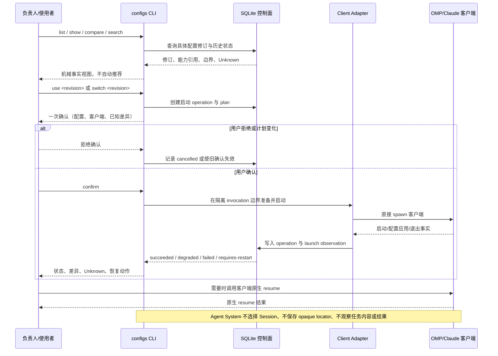

# 业务现状

## 调查口径

- 业务基线日期：2026-08-30
- 业务范围：本仓当前 `configs` 控制面及其资料治理边界；不把未来目标态、历史 Python CAP 或未运行验证的能力当作当前业务事实。
- 材料口径（来源、版本、完整性）：以 `README.md`、`entrypoints/agent-system.md`、`openspec/config.yaml`、三份生效 OpenSpec、`packages/control-plane/src/cli/index.ts` 与领域模型为主；BMad 产物只作迁移输入和历史证据。CLI 本次 `--help` 实际启动失败，原因是缺少 `react/jsx-dev-runtime`，因此下文对可用性的判断以源码和合同为准，并单独标记未完成运行观察。

## 角色与责任

| 角色/系统 | 当前责任 | 输入 | 输出 |
|---|---|---|---|
| 负责人/使用者 | 查看、比较并选择具体配置修订；确认、拒绝、切换或恢复 | 配置修订标识、客户端选择、可选透传参数 | CLI 选择、一次确认或拒绝、对 OMP 原生 resume 的操作 |
| `configs` CLI | 提供配置查询、比较、搜索、建立/修订、供应、启动、切换、状态和恢复入口 | 命令行参数、SQLite、供应目录、客户端参数 | 配置视图、启动计划、状态、失败原因、子客户端进程 |
| SQLite 控制面 | 保存配置修订、启动 operation、启动观察等产品事实 | 应用命令写入 | 可回读的修订、operation 和 observation |
| OMP / Claude Code adapter | 将控制面计划转换为对应客户端的探测、启动和观察动作 | 具体修订、客户端版本/能力、调用作用域输入 | 客户端进程、配置应用结果、启动观察；客户端继续拥有原生会话内容 |
| OMP / Claude Code 原生客户端 | 拥有凭据、transcript、缓存、原生 Session 和原生恢复操作 | adapter 传入的启动参数与不透明任务输入 | 原生交互和原生 Session 状态；当前产品不解析任务内容 |
| OpenSpec / 仓内文档 | 记录长期 capability 合同、变更工件和迁移证据 | 公开仓库材料、负责人裁决 | 可审查的规范、现状、计划、测试和验收记录 |

## 当前业务流程

## 业务对象与状态

| 对象 | 关键字段/身份 | 状态 | 状态变化条件 |
|---|---|---|---|
| 配置修订 `ConfigurationRevision` | `configName`、不可变 `revisionId`、schema version、default marker、scope boundary、availability、capabilities、`evidenceRef`、`supersedesRevisionId` | 已保存、可解析或 Unknown；修订本身不可原位改写 | 建立/修订追加新修订；被替代关系通过 `supersedesRevisionId` 表达 |
| 启动 operation `ActivationOperation` | `operationId`、revision/client、plan hash、version、terminal reason | `prepared` → `awaiting-confirmation` → `applying` → `succeeded` / `degraded` / `failed`；也可 `cancelled` 或 `requires-restart` | 用户确认、拒绝、计划执行、可选项失败、必需项失败、切换或需重启 |
| 启动观察 `LaunchObservation` | `observationId`、`operationId`、client、stage、outcome、process reference、reason | stage：`process-started`、`context-written`、`process-exited`、`outcome-observed`；outcome：`succeeded`、`degraded`、`failed`、`incomplete`、`unknown`、`not-available` | adapter 观察到进程、上下文写入、退出或结果；没有观察时保持 Unknown/不可用 |
| 供应候选 | CLI 的 `supply --config-name ... --group ...` 输出候选数据 | 当前源码存在生成入口；本次未完成真实供应运行观察 | 读取供应组并生成候选；是否进入持久化修订由后续 `establish`/`revise` 路径决定 |

## 异常与失败分支

| 场景 | 当前行为 | 业务影响 |
|---|---|---|
| 没有配置或修订不存在 | 查询/启动返回类型化失败，不静默恢复默认 | 使用者无法启动，需提供有效修订或供应配置 |
| 必需引用不可达、schema/client 版本不兼容或工件不完整 | 按合同 fail closed；不伪造成功、不自动回退 | operation 进入失败或 Unknown，需按恢复动作处理 |
| 仅 optional 能力失败 | 可标记 `degraded` 并列出差异与 Unknown | 客户端可能启动，但使用者能看到不完整装配 |
| 使用者拒绝确认 | 不启动，operation 进入 `cancelled` | 无客户端副作用 |
| 配置切换 | 当前进程不热改；新修订创建新 plan，并返回 `requires-restart` | 使用者需重启后再确认；不自动 resume |
| OMP/Claude 进程启动失败或退出 | 记录失败阶段、原因和 observation；不写成配置已生效 | 使用者需要重试或修复客户端/配置 |
| CLI 直接启动检查 | 本次实际命令因缺少 `react/jsx-dev-runtime` 失败 | 当前工作区不能据此宣称 CLI 可运行；需要单独修复依赖/安装状态后再做运行验收 |

## 当前边界与已知问题

- 当前明确的产品主路径是“查看/比较 → 使用者选择具体修订 → 一次确认 → 客户端启动 → 查看控制面状态”；不包含 Agent 自动推荐、任务语义判断、任务结果验证或跨 Session 任务交接。
- `packages/control-plane/src/cli/index.ts` 同时暴露 `establish`、`revise`、`supply` 等配置供应入口；它们是源码可见路径，不等于本次已经观察到真实端到端可用。
- `openspec/specs/` 当前仅有三份生效规范；大量 BMad 规格、旧 OpenSpec 条目和 `_archive/` 内容属于迁移输入/历史资产，不能与当前业务事实混列。
- 本文件只陈述当前业务事实和已观察到的缺口；目标状态、改造切片和回滚方案进入 `05-改造方案/改造方案.md`。
