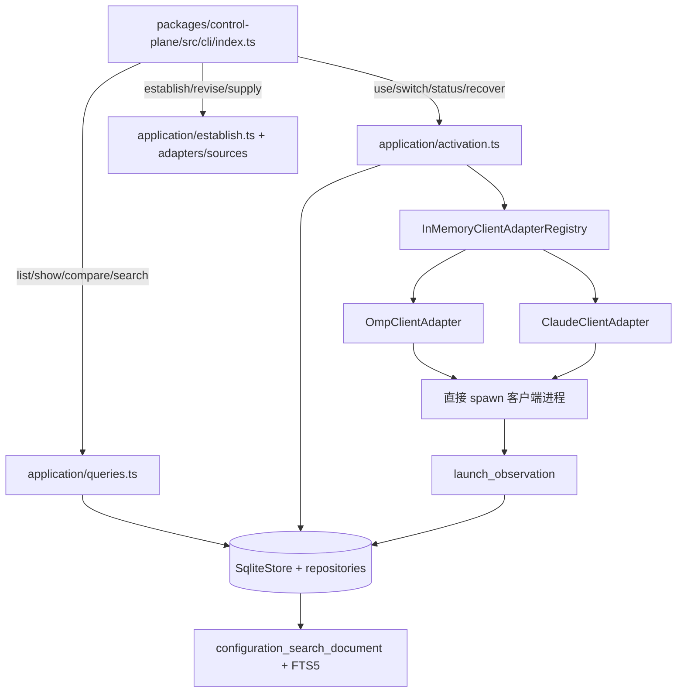

# 技术现状

## 调查基线

- 主干基线 commit：本次调查开始时工作分支 `Eridanus117/clearify` 的 `HEAD` 为 `ccd54d7046b7fda4f08db48ab70556bef23ad206`；调查前工作区无既有修改。
- 需求分支 commit：同上；本次 change 与已初始化的 `.delivery-spec-runtime` 尚未提交。
- 运行态核验时间点：2026-08-30；`npx openspec validate --specs --strict` 实际通过，`bun packages/control-plane/src/cli/index.ts --help` 实际失败。

| 仓库 | 模块 | 证据类型（源码/历史测试/运行态/推断） | 核验方式 |
|---|---|---|---|
| 当前仓 | `openspec/` | 源码/配置/运行态 | 读取 `config.yaml`、三份 live spec；CLI `doctor`、`schemas`、strict validate |
| 当前仓 | `packages/control-plane/src/cli` | 源码 | 读取 `cli/index.ts`；确认 list/show/compare/search/status/recover/use/switch/establish/revise/supply 分发 |
| 当前仓 | `packages/control-plane/src/application` | 源码 | 读取 `harness-composition.ts`、`public-entry.ts`；确认 SQLite、adapter registry 和 public facade 组合 |
| 当前仓 | `packages/control-plane/src/domain` | 源码 | 读取 configuration、activation-operation、launch-observation 模型 |
| 当前仓 | `packages/control-plane/src/adapters` | 源码 | 读取 SQLite migration 与 client adapter 入口；确认 OMP/Claude adapter、隔离 invocation 和观察边界 |
| 当前仓 | `packages/control-plane` | 运行态 | 执行 `bun .../cli/index.ts --help`；Bun 1.3.14 报 `Cannot find module 'react/jsx-dev-runtime'` |
| 当前仓 | `_bmad-output/`、`_archive/` | 历史证据 | 读取当前入口指向的 BMad 迁移产物和归档目录清单；不把其内容当作新实现基线 |

## 当前技术流程

## 接口与数据边界

| 边界 | 当前接口/模型 | 调用方 | 副作用 | 失败语义 |
|---|---|---|---|---|
| CLI → application | `main(argv)`；`use`/`switch`/查询/供应命令 | `configs` 可执行入口 | 打开依赖、写 operation 或输出视图 | 捕获后通过 `renderQueryFailure` 返回错误码 1；未知命令直接失败 |
| 配置查询 → SQLite | `SqliteConfigRevisionRepository`、`SqliteActivationOperationRepository`、`SqliteLaunchObservationRepository` | queries/activation | 读取或追加控制面事实；搜索重建写 FTS 投影 | 缺失修订、无 operation、解析失败保持类型化失败，不自动 fallback |
| application → adapter registry | `ClientAdapter`、`ClientAdapterRegistry`、`prepareActivation`/`executeActivation` | activation、harness facade | probe、生成计划、启动客户端、记录 observation | adapter 不可用或 required 项失败进入 failed/unknown；optional 项可 degraded |
| adapter → 客户端 | OMP/Claude adapter 的 probe、plan、launch、interpret 端口 | application activation | invocation 隔离目录、配置物化、直接 spawn | 进程/上下文/结果各阶段独立记录；退出码不单独等同验证成功 |
| public facade → control plane | `HarnessControlPlanePort` 的 `readRevision`、`readManifest`、`probe`、`planLaunch` | 外部 harness 集成 | 只读投影或准备启动计划 | 依赖异常转为 `unknown`，携带 reasonCode、observedAt 和 recovery |
| 持久层 → legacy 数据 | `legacy_schema_inventory`、`legacy_launch_plan` 与 `SqliteStore.migrate()` | SQLite 初始化 | 对旧表做快照/登记/迁移，重建 canonical projection | 迁移失败关闭数据库并清理 staging；不覆盖源数据库的并发变更 |

## 事务、缓存、通知和兼容

- 事务：SQLite 迁移在 staging 数据库执行；发现旧 schema 时，旧结构登记与数据复制在一个 SQLite transaction 中完成。应用层 operation 状态按领域转移规则推进，状态值包括 `prepared`、`awaiting-confirmation`、`applying`、`succeeded`、`degraded`、`failed`、`cancelled`、`requires-restart`。
- 缓存：未发现独立远程缓存或 daemon。`configuration_search_document` 与 FTS5 是本地可重建搜索投影；`SqliteStore.rebuildSearchProjection()` 可重建。
- 通知：未发现产品级遥测、远程通知或事件总线。CLI 输出和客户端进程观察是当前反馈通道；自更新模块会在 CLI 启动时安排后台检查，但本次未运行验证。
- 兼容：根 workspace 使用 TypeScript/Bun；control-plane 的 bin 指向 `src/cli/index.ts`。SQLite 迁移保留 `legacy_schema_inventory`/`legacy_launch_plan` 作为历史输入记录；adapter registry 当前在生产组合中注册 OMP 与 Claude Code，不能据此推导其他客户端兼容。

## 部署与运行态

| 事实 | 环境/机器 | 证据 | 核验时间 |
|---|---|---|---|
| OpenSpec root 可解析 | 当前仓库 | `npx openspec doctor`：root ok | 2026-08-30 |
| `delivery-change` runtime 可用 | 当前仓库 `.delivery-spec-runtime` | 子模块从 gitlink 初始化至 `4896699085a35713b8221a1c878d60c725a47014`；`npx openspec schemas` 列出 project schema | 2026-08-30 |
| 三份 live spec 合同有效 | 当前仓库 | `npx openspec validate --specs --strict`：3 passed / 0 failed | 2026-08-30 |
| control-plane CLI 可直接启动 | 当前仓库/Bun 1.3.14 | 未通过：`Cannot find module 'react/jsx-dev-runtime'` | 2026-08-30 |
| control-plane 发布包/远程部署 | 未观察 | 当前代码与本次调查未发现可回读发布产物或部署环境 | 2026-08-30 |

## 已知缺口与不确定性

- `[事实]` 当前工作区在初始化 runtime 后有一个可解析的自定义 `delivery-change` schema；创建的 `repository-baseline-inventory` 已通过 strict change validation。
- `[事实]` 当前 live OpenSpec 只有 `agent-behavior-evaluation`、`agent-skill-design`、`research-first-assembly` 三项；`.cap` 耦合的旧 spec 已放在 `_archive/openspec/specs/`。
- `[事实]` `packages/control-plane` 的源码有 OMP/Claude 两个 adapter 和多条 CLI 命令，但本次 CLI 真实启动被 React 运行依赖错误阻断；不能以源码存在宣称端到端可用。
- `[事实]` BMad 产物仍然体量较大，并被 `entrypoints/agent-system.md` 定义为迁移前输入；本次尚未完成 BMad 到 live OpenSpec/仓内版本化文档的逐条覆盖矩阵。
- `[推断]` 设计混乱的主要风险之一是“当前事实、目标架构、历史证据和未运行能力”分散在不同目录并在叙述中交叉引用；需要下一阶段按主题建立覆盖矩阵，而不是先重写实现。
- `[推断]` React 依赖解析失败可能来自依赖未安装或 workspace 安装状态不完整；尚未执行安装、修复或再次运行，因此不在本 change 里提前定性根因。
- 目标实现、改造切片、测试设计和回滚边界只进入 `05-改造方案/` 及后续工件。
