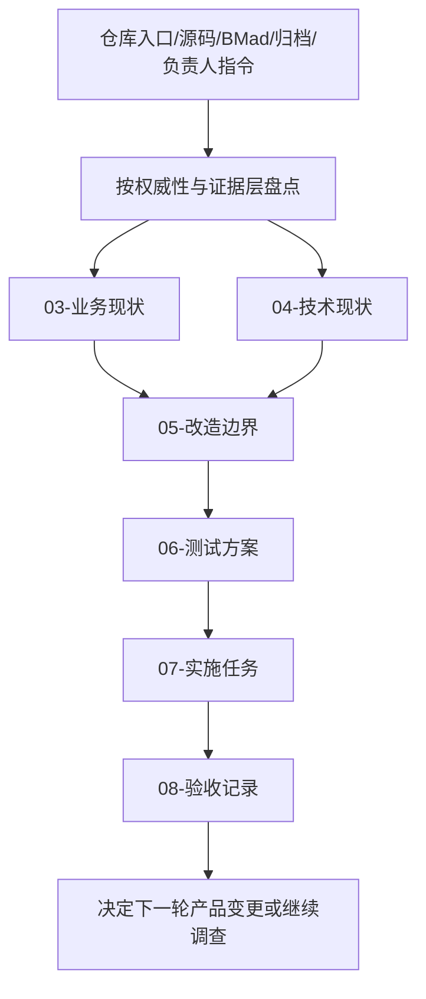

# 改造计划

## 目标与非目标

### 目标

- 完成第一轮仓库现状基线：把已生效规范、仓内入口/合同、BMad 迁移输入、历史归档和当前源码入口分层记录。
- 让每个关键判断都有可回读路径，并明确区分源码事实、实际运行事实、历史证据和推断。
- 明确后续真正产品变更必须从哪一层发起：产品需求进入 `openspec/specs/`，变更证据进入 `openspec/changes/`，仓内架构/操作规则进入版本化文档，BMad 只作迁移输入。
- 以最小可验证工件结束本轮，不因发现混乱而直接重构代码、搬迁资料或删除 BMad/归档资产。

### 非目标

- 不修改当前产品代码、数据库 schema、CLI 行为、客户端 adapter 或用户全局配置。
- 不把 `_bmad-output/` 批量改写成 OpenSpec，也不在没有逐条覆盖证据时退役 BMad 产物。
- 不恢复 `_archive/` 中的历史 OpenSpec、Python CAP 或旧架构为当前需求。
- 不创建新的产品 capability spec；本 change 已声明 `skip_specs: true`，因为它是资料基线而非产品需求增量。
- 不发布、同步、归档本 change 或改变 GitHub 生命周期。

## 目标业务与技术流程

## 影响面

| 仓库/系统 | 模块/接口 | 变更 | 兼容约束 | 责任方 |
|---|---|---|---|---|
| 当前仓 | `openspec/changes/repository-baseline-inventory/` | 新增现状基线工件与机器来源合同 | 不改变 live specs；不产生产品 delta | 当前维护 Session |
| 当前仓 | `openspec/config.yaml`、`.delivery-spec-runtime` | 仅使用既有 `delivery-change` 配置；初始化声明的 runtime submodule | 保持 gitlink 与相对软链合同 | 仓库维护者 |
| 当前仓 | `_bmad-output/`、`_archive/` | 只读引用和分层标注 | 不删除、不重写、不提升历史材料权威 | 后续迁移负责人 |
| 当前仓 | `packages/control-plane/` | 只读源码盘点；记录 CLI 运行阻断 | 不修改 TypeScript/Bun 实现或依赖 | 后续实现负责人 |

## 实施切片与依赖

| 顺序 | 切片 | 前置 | 独立验收 | 回滚边界 |
|---:|---|---|---|---|
| 1 | 原始材料索引与来源机器合同 | 当前会话、入口规则、OpenSpec 配置 | raw-requirements strict validation | 删除本 change 目录，不触碰其他资产 |
| 2 | 业务与技术现状基线 | 切片 1；源码和模型可回读 | 文档结构完整、事实/推断分层、Mermaid 可读 | 仅回退本 change 工件 |
| 3 | OpenSpec/迁移边界记录 | 切片 2；确认 live/archive/BMad 分层 | 计划明确目标/非目标/迁移/回滚 | 不改变长期规范；回退 05 文档 |
| 4 | 基线验收与后续入口 | 切片 3；测试方案与任务状态 | strict validate、CLI/runtime 结果均有原始证据 | 不创建 release；保留失败/阻断记录 |

## 数据与兼容迁移

- 数据：本 change 只新增 Markdown 工件与 `change-sources.json`；不写入控制面 SQLite，不复制凭据、私域原文、prompt、transcript 或运行时秘密。
- 接口：不改现有 CLI、TypeScript exports、SQLite 表或客户端 adapter port；OpenSpec change 自身使用 `delivery-change` schema。
- 灰度：不适用。资料基线只在本 change 目录中生成，不改变其他用户可见入口。
- 回滚：删除或版本回退本 change 新增工件即可；`.delivery-spec-runtime` 子模块初始化属于既有仓库声明的开发依赖，不将其内容复制进本 change，也不修改其 commit。

## 风险与处置

| 风险 | 影响 | 预防/缓解 | 停止条件 |
|---|---|---|---|
| BMad 与新入口仍有相互矛盾的历史表述 | 后续误把迁移输入当权威 | 每份基线文档标明来源层；建立逐条覆盖矩阵前不退役 | 无法区分当前规则与历史规则时停止产品改造 |
| 源码存在被误读为真实可用 | 形成虚假验收结论 | 记录 CLI 实际失败及证据；运行态未知保持 Unknown | 无法取得可回放运行证据时不得宣布可用 |
| 资料整理扩大成架构重写 | 范围、风险和回滚成本失控 | 本 change `skip_specs: true`，只做基线工件 | 出现代码/数据库/用户配置修改需求时另开产品 change |
| runtime 子模块未初始化或软链漂移 | OpenSpec 工作流不可执行 | 使用 `openspec doctor`、`schemas`、strict validate 核验 | runtime 合同不满足时不继续实施/验收 |
| 现状工件包含私人内容或秘密 | 违反公开仓边界 | 只记录路径、类型、状态和摘要，不复制原文 | 发现敏感原文进入工件时立即停止并清除该工件内容 |

## 决策日志

| ID | 决策 | 依据 | 替代方案 | 影响 | 日期 |
|---|---|---|---|---|---|
| D-001 | 先建立资料基线，再决定产品改造 | 负责人要求先搞清楚现状；当前 live specs、BMad 和 archive 分层不一致 | 直接重构代码或先重写全部规范 | 本轮只新增可回读基线，不改变产品行为 | 2026-08-30 |
| D-002 | 使用仓库自有 `delivery-change` OpenSpec | `openspec/config.yaml` 已声明；runtime 子模块初始化后 CLI 可解析九层流程 | 使用默认 `spec-driven` 或继续沿用 BMad | 当前 change 遵循 raw → current → plan → test → tasks → acceptance 生命周期 | 2026-08-30 |
| D-003 | 本 change 声明 `skip_specs: true` | 目标是资料盘点，不是产品需求增量；默认 delta 门禁会错误要求新增 capability | 虚构一个无业务意义的 Requirement delta | 不更新 `openspec/specs/`；后续产品结论另开 change | 2026-08-30 |
| D-004 | 不提前删除或批量迁移 BMad/归档材料 | 入口规则要求完成覆盖核验前保留 BMad；历史材料仍有证据价值 | 立即清理“看起来重复”的目录 | 增加后续覆盖矩阵工作，但保留可逆性和追溯性 | 2026-08-30 |
| D-005 | 将 CLI 运行依赖错误记录为当前 Unknown/阻断 | `bun ... --help` 实际报 `react/jsx-dev-runtime` 缺失，尚无安装/修复证据 | 仅依据源码宣称 CLI 可用，或立即修改依赖 | 后续需单独确定依赖环境问题是否属于产品 change | 2026-08-30 |

## 待决问题

- `_bmad-output/` 到 `openspec/specs/` 与仓内版本化文档的逐条覆盖关系尚未形成完整矩阵；这是下一轮资料整理的独立工作，不在本轮假装完成。
- control-plane CLI 的依赖安装/解析失败根因尚未确定；在没有明确范围前不修改依赖或源码。
- 还没有负责人明确的具体产品缺陷清单；后续若发现需改代码的事项，应按本基线另开有真实 Requirement delta 的 OpenSpec change。
