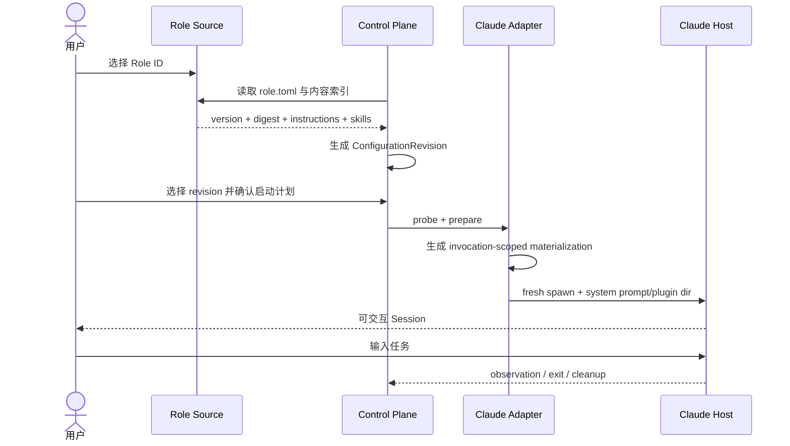

# 业务现状

## 调查口径

- 业务基线日期：2026-08-30
- 业务范围：用户选择一个 Role 后，将其 instructions/skills 装配到 Claude Code fresh Session 并执行任务。
- 材料口径：负责人确认的 Issue #18、当前 control-plane 源码、Agent Roles `role-v1` 与 `su-ccb` 公开说明、PR #11；历史 BMad 只作架构证据。

## 角色与责任

| 角色 | 当前责任 |
|---|---|
| 用户/负责人 | 选择 Role 或配置修订，确认启动计划，提供当前任务 |
| Role source/catalog | 提供版本化 Role 定义、instructions、skills 和 adapter hints；不保存项目状态 |
| Agent System control-plane | 保存配置修订、解析能力引用、生成客户端计划、执行确认和启动生命周期 |
| Claude Code Host Adapter | 将 instructions、skills、MCP 等投影到 Claude 的调用作用域 |
| Claude Session | 消费已投影能力并执行用户任务；不拥有 Role source |
| 验证/观察层 | 区分声明态、配置态、实际运行态，保存 observation/receipt/evidence |

## 当前业务对象与状态

| 对象 | 当前事实 | 缺口 |
|---|---|---|
| Role | 公开规范定义为静态 source package | control-plane 尚无 Role source 一等读取入口 |
| ConfigurationRevision | SQLite/domain 已有不可变能力引用集合 | 尚未由 Role 选择直接生成 |
| AssemblyPlan | Claude materializer 与 adapter 已有实现基础 | 用户入口无法稳定启动，计划展示不完整 |
| Session/Invocation | invocation 目录、激活 operation、launch observation 已建模 | CLI 端到端运行尚未通过 |
| Task | 用户应在宿主 Session 中输入 | 当前没有 Role 激活后自动进入宿主的稳定入口 |

## 主路径

## 失败分支

- Role 不存在、`role.toml` 无效或 sourceRef 不可读：拒绝生成 revision。
- 必需 Skill 或 instruction 无法解析：fail closed，不用空内容代替。
- Claude 不存在、版本未知或所需 flag 不支持：计划不可执行，不能伪造成功。
- 用户未确认：只保留 prepared/awaiting-confirmation，不启动进程。
- 已运行 Session 试图热切换：终态为 `requires-restart`，不修改已有 Session。
- 启动后清理失败：保留启动结果并记录清理偏差，不覆盖真实结果。

## 当前缺口

当前可公开使用的 Role 包管理器停在 install/check/resolve；PR #11 提供了 profile 选择原型但没有纳入 control-plane。因而“选哪个 Role”与“让哪个 Session 执行任务”之间尚无当前稳定产品闭环。
