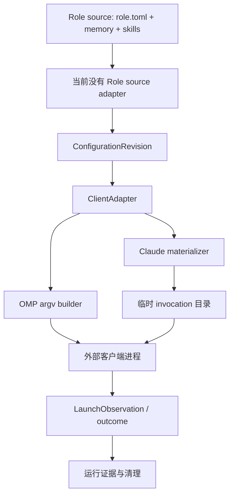

# 技术现状

## 调查基线

- 主干基线 commit：`cb5bfd5c1eb14f8bf5fd6b59e826cf58e7f8b810`（PR #16 合并结果）
- 需求分支 commit：当前工作分支从已合入主线切出，代码实现尚未开始。
- 运行态核验时间点：2026-08-30

| 仓库 | 模块 | 证据类型（源码/历史测试/运行态/推断） | 核验方式 |
|---|---|---|---|
| agent-system | `packages/control-plane/src/domain/configuration.ts` | 源码 | `ConfigurationRevision` 保存能力引用、revision 链和 evidenceRef |
| agent-system | `packages/control-plane/src/domain/capability.ts` | 源码 | 支持 `instruction/skill/mcp/hook/plugin` 与 sourceRef/fingerprint |
| agent-system | `packages/control-plane/src/adapters/clients/client-adapters.ts` | 源码 | OMP/Claude 共用 `ClientAdapter`，prepare/start/observe/cleanup |
| agent-system | `packages/control-plane/src/adapters/clients/claude/content-materializer.ts` | 源码 | instruction、skill、MCP 的 invocation-scoped 物化 |
| agent-system | `packages/control-plane/src/adapters/omp/process-port.ts` | 源码 | OMP 通过 `--skills`/`--no-skills` 构造 argv |
| agent-system | `packages/control-plane/src/cli/tui.tsx` | 运行态事实 | 未安装 workspace 依赖时曾触发 `react/jsx-dev-runtime`；`bun install --frozen-lockfile` 后 `--version` 与 `list` 可运行，`--help` 不是现有命令 |
| agent-roles-spec | `specs/role-v1.md` | 公开规范 | Role source、role.toml、memory、skills、adapters 和 future mount boundary |
| agent-system | PR #11 `tools/sk` | 历史/候选原型 | profile、manifest、overlay、`sk run`；未合入且有 P1 问题 |

## 当前技术流程

## 接口与数据边界

| 边界 | 当前合同 | 当前问题 |
|---|---|---|
| Role source → control-plane | 无正式 adapter；外部规范只定义 `role.toml` | 不能通过 Role ID 生成 revision |
| revision → capability | `CapabilityReference`，kind/name/source/sourceRef/fingerprint | 需要把 Role 内容映射为稳定 sourceRef |
| capability → Claude | instruction 拼接、Skill 目录复制、MCP JSON | 已有源码路径；需要通过 Role source 输入和真实 Claude smoke 验证 |
| capability → OMP | Skill 名称 argv | instruction/完整 Role surface 不等价 |
| adapter → process | `Bun.spawn([executable, ...argv])`，无 shell 拼接 | 适合保持参数边界和清理合同 |
| process → observation | `waitForExit` 与 outcome | 真实交互式 Session 尚缺受控 smoke |
| source → projection | Claude 使用 invocation 目录；终态清理 | 不得写回 Role source、SQLite 或公共投影 |

## 数据与运行状态

- SQLite 默认位于 `$HOME/.agent-system-state/control-plane/control-plane.sqlite3`。
- 配置修订、激活操作和启动观察由 SQLite repository 持久化；查询和 projection 不改期望状态。
- Claude 物化位于同一状态根下的临时 invocation 目录，终态后清理。
- `Role source` 必须保持静态、可审查和不含项目任务、会话历史、凭据或运行态。
- 项目绑定、具体任务、权限授予和 Session 状态必须留在 Role source 外。

## 已知失败与未知

- workspace 依赖安装后的 CLI 基础入口已可运行；`--help` 尚未定义，不能把 unknown command 误判为启动失败。
- Role source 读取、Role → revision 组成、Role 版本/digest 保留尚未实现。
- Claude 物化源码路径存在，但还没有本 change 范围内的真实 Role→Session 运行证据。
- OMP、Codex、热切换和多 Role 冲突规则不纳入第一条垂直切片。
