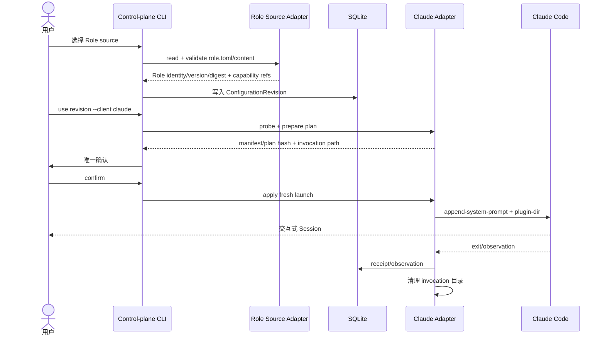

# 改造计划

## 目标与非目标

### 目标

- 确认 workspace 依赖安装后的 control-plane CLI 基础入口可运行，不把依赖未安装误判为源码阻塞。
- 接受一个公开本地 Role source，读取 `role.toml`、Role instruction/memory 与 `skills/`，保留 Role version、source 和 digest。
- 将 Role 内容转换为 `ConfigurationRevision` 的稳定 `CapabilityReference[]`。
- 使用现有 Claude adapter 生成 invocation-scoped System Prompt 和 Skill plugin 目录。
- 通过既有 operation/confirmation/observation/cleanup 路径启动 fresh Claude Session。

### 非目标

- 不重写 `agent-roles-spec`，不实现远程 catalog、通用 install/update。
- 不原样合入 PR #11 的 `sk`；不保留一套绕过 control-plane 的启动路径。
- 不在本 change 完成 OMP、Codex、多 Role 冲突编排、热切换或团队共享。
- 不把 Role source、项目任务、Session 状态、凭据或 transcript 写入公共 Role 包。
- 不声称一次配置成功等于真实任务行为改善；真实任务证据单独记录。

## 目标流程

## 仓库切片

| 切片 | 位置 | 结果 |
|---|---|---|
| CLI 启动 | `packages/control-plane/package.json`、CLI 入口与锁定依赖 | `--version`、`list` 等现有入口在 `bun install --frozen-lockfile` 后可运行，不引入绕过 TUI 的假入口 |
| Role source adapter | `packages/control-plane/src/adapters/sources/` 或现有 source 边界 | 只读解析 Role metadata/content，拒绝越界和无效 source |
| 配置组成 | `packages/control-plane/src/application/`、`domain/configuration.ts` | Role 版本/digest 映射为 immutable revision |
| Claude 装配 | `packages/control-plane/src/adapters/clients/claude/` | instructions/skills 进入 invocation 物化；失败关闭 |
| 用户入口 | `packages/control-plane/src/cli/` | explicit Role/revision/client 选择，保留一次确认 |
| 验证 | `packages/control-plane/tests/`、受控 smoke | 通过定向测试和真实可观察启动证据证明路径 |

## 兼容与迁移

- 既有 `ConfigurationRevision`、`CapabilityReference`、`ClientAdapter`、SQLite schema 和 operation 状态机保持兼容。
- 既有直接 revision 启动路径保留；Role adapter 只是新增 source/compose 入口。
- Role 的 `memory.md` 在第一版映射为 `instruction` 内容，不单独引入持久 Memory runtime。
- sourceRef 使用受控 supply root 的安全相对路径；不复制 Role source 到全局配置。
- PR #11 的 profile manifest 可以作为人工迁移输入，但不自动执行或信任 junction；其后续应生成 revision，而不是直接 spawn。

## 风险与回滚

| 风险 | 防护 | 回滚 |
|---|---|---|
| CLI 依赖环境 | 依赖未安装或版本漂移 | workspace 使用 `bun install --frozen-lockfile`；不修改产品源码以掩盖环境问题 | 保留原始失败证据，恢复依赖环境 |
| Role source 路径越界或读取私人内容 | 安全相对路径、allowlist 和公开 source 检查 | 拒绝 revision，不写入数据库 |
| Skill 名称/目录冲突 | 预检冲突并 fail closed | 不创建可用 revision |
| Claude 物化部分成功 | required failure closed；终态清理 | 删除 invocation，保留 operation failure |
| Role 内容与宿主语义不兼容 | adapter 明确 unsupported/degraded | 不启动或返回 requires-restart |

## 决策日志

- D001：第一条真实闭环只支持 Claude Code。原因：当前仓已有 instruction/skill materializer 和对应 adapter；OMP/Codex 需要独立 parity 证据。
- D002：Role source 不直接成为运行权威；先转换为带版本/digest 的 `ConfigurationRevision`。原因：保持 control-plane 的不可变修订、回滚和审计语义。
- D003：`sk` 定位为未来的 profile/Role 编辑快捷入口，不作为第二个 launcher。原因：避免绕过 plan、confirm、operation、observation。
- D004：先确认锁定依赖安装后的 CLI 基础入口，再实现 Role compose。原因：此前失败来自未安装 workspace 依赖；当前 `--version`/`list` 已可运行，Role compose 不应等待虚假的 CLI 源码阻塞。
